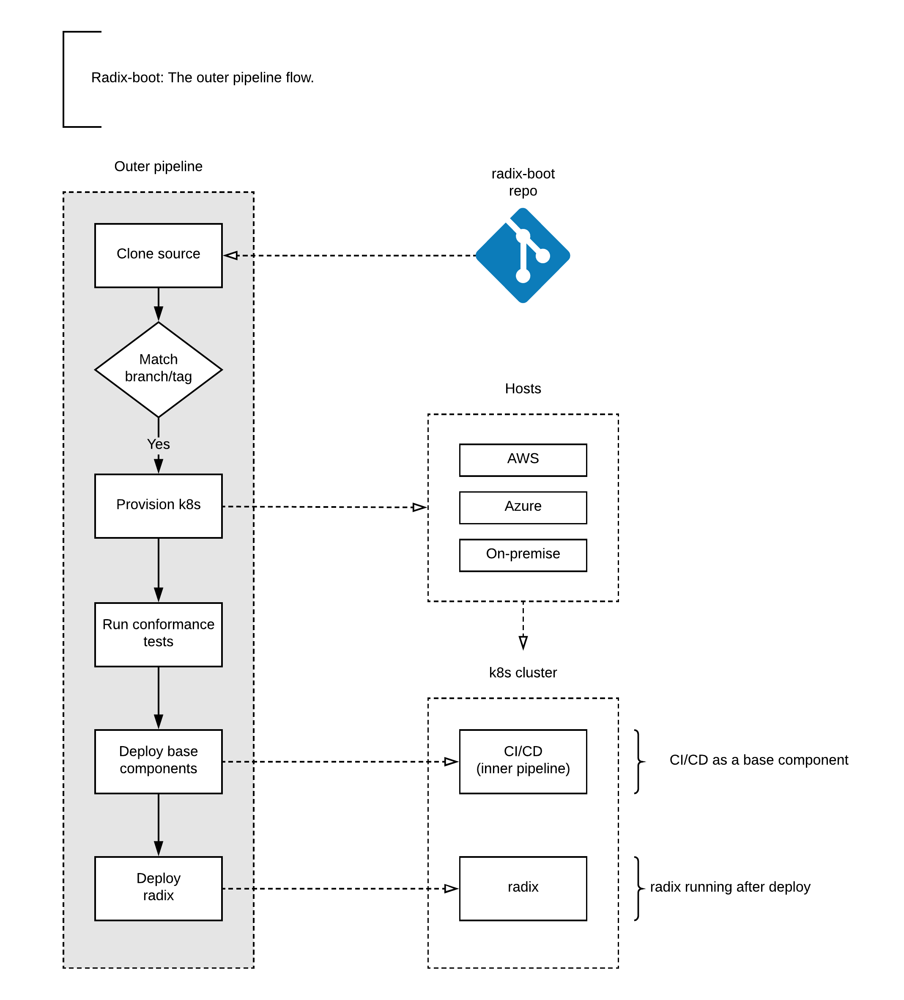
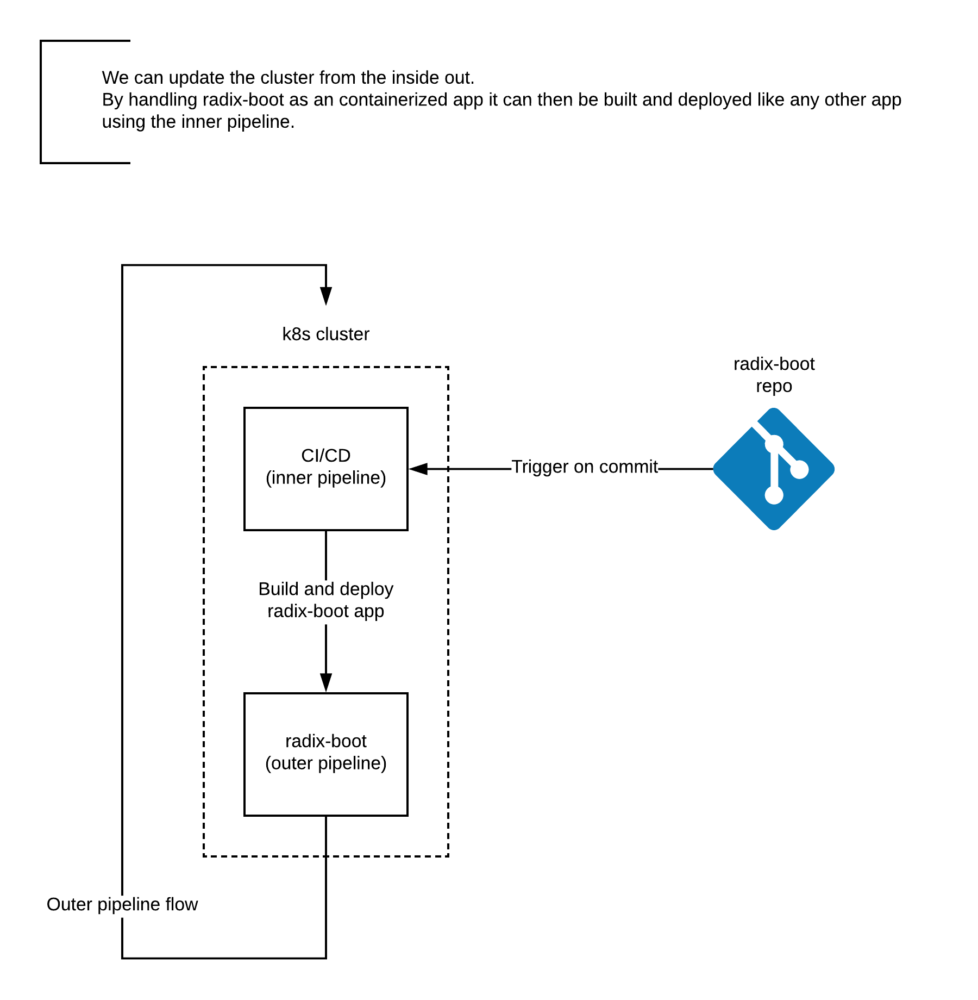
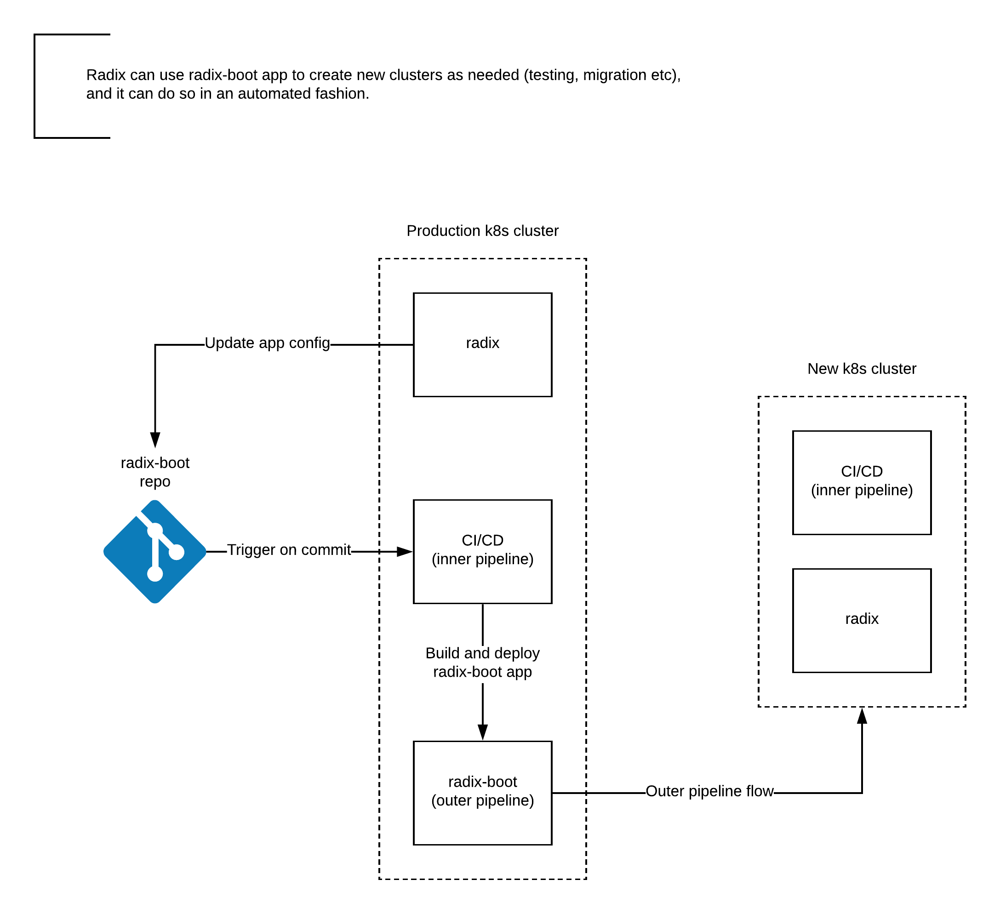

## Lifecycle

Think of a k8s like a bag that contains all kind of stuff.
To use it then we first need a bag. The outer pipeline provides us with that bag.
To fill the bag we use the inner pipeline.
To decide what goes into the bag we use a container application platform (Omnia Radix).

The outer pipeline is the base infrastructure and components setup, removal and initialization process. The inner pipeline is a base component, the CI/CD system that build and deploys everything else, including the container application platform and its components.

## Outer pipeline
  * Responsible for provisioning a new cluster
  * Responsible for deploying the base infrastructure components (ex the inner pipeline) inside the cluster
  * Responsible for bootstrapping the container application platform. It can do so by triggering the initial build and deploy of the container application platform on the inner pipeline

## Inner pipeline
  * Responsible for the build and deploy of any resources and their configurations inside the cluster (CI/CD)

## Container application platform
  * Responsible for governing the cluster. It does this mainly by controlling what is processed by the inner pipeline.

