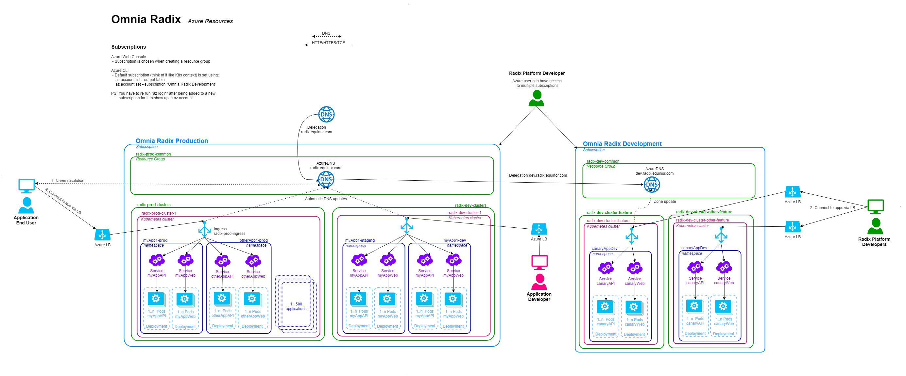

# DNS

Equinor responsible for DNS only wants to delegate 1 zone.
We delegate radix.equinor.com to a AzureDNS service in the `Omnia Radix Production` Subscription. We delegate dev.radix.equinor.com to another AzureDNS service running in the `Omnia Radix Development` Subscription.

Services in Production clusters have access to update (some?) subdomains of radix.equinor.com while Services in Dev clusters have access to update (some?) subdomains of dev.radix.equinor.com.

The most common use case would probably for one or more Ingress to expose themselves using a Service with a dynamically allocated LoadBalancer from the cloud provider.

Equinor DNS POC: Knut Petter Ølberg

TODO: Find and upload picture to `radix-resources` repo.