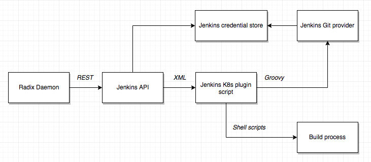

# Pipeline framework

We need a platform for our platform. The pipeline framework is the core of the logic in STaaS: how and which steps are executed, what are their inputs and outputs, how they are monitored, etc. We have a few options to consider:

  * [Jenkins](https://jenkins.io/)
  * [Brigade](https://github.com/azure/brigade/)
  * [Concourse](https://concourse-ci.org/)
  * [Drone](http://docs.drone.io/getting-started/)
  * [InfraBox](https://infrabox.net/)

While considering these frameworks, we will use this simplified specification of the steps a typical job will perform:

  * Checkout from GitHub (with injected deploy key)
      * Input: git repo address, deploy keys
      * Output: The Sauce
  * Pre-build compliance step (e.g. lint) (via a Docker image)
      * Input: The Sauce, a Dockerfile?
      * Output: The Sauce
  * Build the build image
      * Input: A Dockerfile
      * Output: A build env image
  * Build the code
      * Input: Build env image, The Sauce
      * Output: An image
  * Run tests
      * Input: An image, a test env docker image
      * Output: An image
  * Post-build compliance step (e.g. dependency scan) (via a Docker image)
      * Input: An image
      * Output: An image
  * Push image to registry
      * Input: An image
      * Output: An image in the registry
  * Push artefact to artefact registry
      * Input: An image in the registry
      * Output: A file or files off that image in the artefact registry
  * Deploy image to environment (env config is injected)
      * Input: A registry image spec, deployment spec
      * Output: Happy developers, happy managers (working system with monitoring)

We don't need to implement all of this to evaluate the options! Let's see how far we get within a couple of days. But we do need to account for these requirements:

  * Every step must be allowed as a start/stop point for a job (by extension, every step must be skippable)
  * Every step can generate output (e.g. logs) that is persisted with the job

## Jenkins

Using Jenkins as the platform means in effect using the [Jenkins K8s plugin](https://github.com/jenkinsci/kubernetes-plugin) (JKP, for short) for executing build pipelines. Our daemon would communicate with Jenkins via its API, and provide job definitions using the Jenkins XML document syntax. Within this we would create a customised Groovy script to perform the tasks relevant to our platform (this script is how the JKP is operated). In effect, we would be using code templates to create the Groovy scripts in the daemon.

A partial view of how a job would be configured and run using Jenkins + JKP. 

A few drawbacks noted:

  * Since the job is defined in a single document, using any sort of libraries, or modularising our code, would be kludgy at best: we could possibly have code files somewhere on the Jenkins server and reference them from the jobs, for instance.
  * For developing/testing our job declaration code we would either require a full local cycle of editing templates, generating jobs, and running the process through a local Jenkins-in-cluster, or we would have to mock up all this environment.
  * The JKP enforces using Groovy scripts, so the majority of Jenkins functionality for running a job which is configured through the UI would have to be recreated in Groovy.
  * A lot of context changes to get code to run (REST → XML → Groovy → Shell)

Good things:

  * The JKP integrates with logging and progress monitoring, so we get the GUI for these things out of the box.

