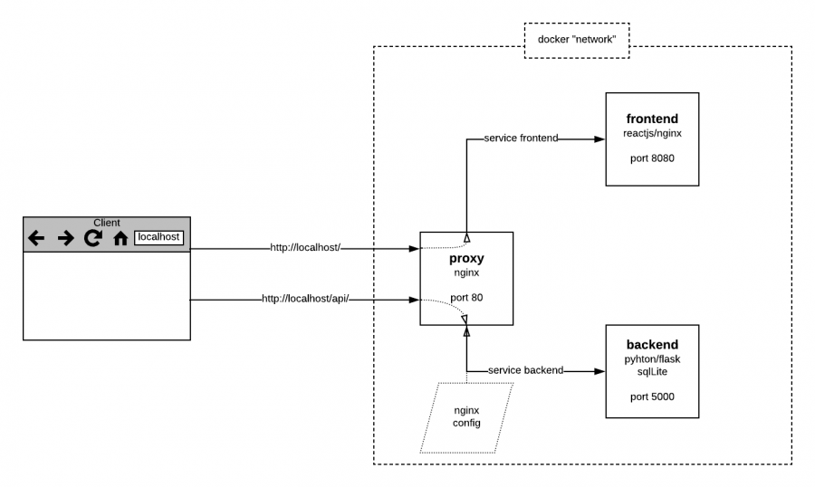
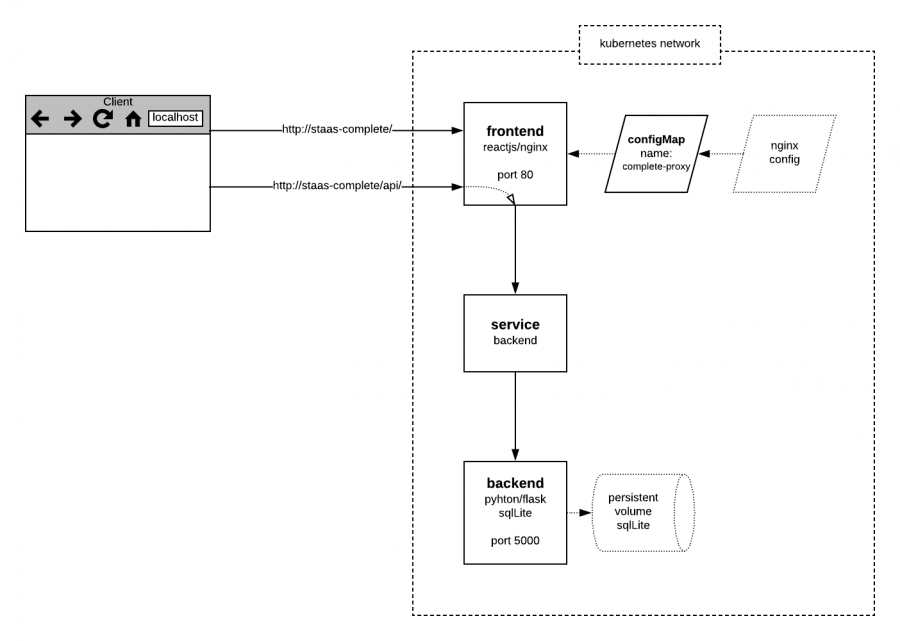
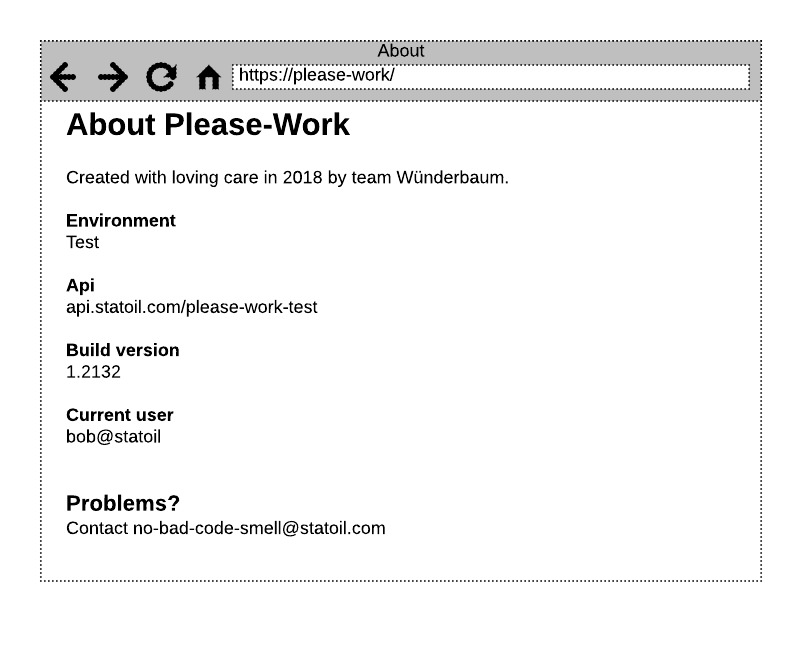

Front-end and back-end for well completion. Based on prototype from gitlab.

## Sources
https://github.com/equinor/complete

_STaaS experimental jenkinsfile for Complete_
https://github.com/equinor/staas-pilot-complete

## Stack
_Frontend_
  * reactjs

_Backend_
  * python
  * flask
  * sqlalchemy
  * SQLite

_Proxy_
  * nginx

Each main component live inside a docker container (total 3 images).

## Contacts
  - Erik Parman
  - Kjell Wilhelm Kongsvik
  - Thorvald Johannessen


## What they do
  * Frontend, backend and the proxy are built using docker multi-stage build for each component
  * They run one container per image, all on same host, using the docker network to connect them all as services
  * The proxy container is the entry point, the config is mounted during docker build
  * Separation of environments (test, qa) is achieved by using separate hosts
  * Images are tagged using git tag as version tag in addition to keywords "stable" or "latest"
  * (Not enabled) Monitoring is handled by Prometheus and Grafana
  * The SQLite db runs in the backend container and use volume mount on the host.



## What we can do
  * We can build their images in STaaS as-is, in serial
  * We can deploy the containers to separate hardware (if so desired) and they will run in isolation
  * We can scale frontend and backend separately
  * We can configure services to expose the containers inside the k8s network
  * We can convert app configurations into k8s objects called "configMaps" and mount them into containers
  * We do not need the proxy container as the frontend container has a nginx webserver which we can configure by mounting a configMap
  * The frontend will be the entry point
  * We can mount a temporary volume for SQLite as we currently do not have a plan for how to handle state
  * (When enabled in app code) We should be able to pick up their Prometheus configuration as-is




## What we learned from building the app in STaaS 
We cannot use our current build pipeline as it can only build one dockerfile, and "Complete" has 3. That said, "Complete" is dockerized with no weird dependencies and we had no problems running each build.

### Repo
Code pull by using a github deploy key (read only).
 
''staas-pilot-complete/Jenkinsfile''
  * Added jenkins script to jenkins job configuration via ui
  * It should be possible to add/update jenkins script via jenkins api (not tested)
  * Backup of the script is kept at https://github.com/equinor/staas-pilot-complete for learning

### Parallel build 
We have tested building all three images in parallel (see https://github.com/equinor/staas-pilot-complete/blob/master/jenkins-scripted-parallel-docker-build.groovy).

This introduced a new set of challenges
  * Hackish loop control
  * Hard to read build log
  * Scaling of docker service

A normal build flow would be to iterate the app "parts" configurations (path to dockerfiles, name of images, etc) and call "docker build" in each step.  

Jenkins pipeline script support the use of parallel steps, but we could not figure out how to use in a loop.

The next step was then try shell script.
This introduces more complexity which is shell script in jenkins pipeline script constricted by kubernetes plugin pipeline script support, using Groovy syntax. The script turns into a magnificent string manipulation adventure very fast, and even though we managed to implement a parallel build process, we could not set the image names in a sane way (possible to do, but time vs hacking...).

When builds ran in parallel then the build log becomes a tangled mess of messages from all three build processes. We attempted to make it more readable by prefixing each log message which made it somewhat more human readable, but it is still not a good solution.

The point of running processes in parallel is speed. In STaaS docker is available as a service. Each instance has its own docker cache. If you scale this service then you will have a hard time pushing your images to container registry due to
  - "docker build" will hit the first instance, and the resulting image will be cached there
  - "docker push" will hit the second instance, it will not find the image in it's cache and the command will fail

Creating a docker service that scales is out of scope for this pilot, so we scaled down the docker service to just one instance. We then lose the point of using parallel build for greater speed as each call will be queued by the docker service. And so we continued on with sequential build flow instead.

### Sequential build
  * Easy to implement (clean code)
  * Easy flow control
  * Readable jenkins log

Ex: https://github.com/equinor/staas-pilot-complete/blob/master/jenkins-scripted.groovy


### Tagging
"Complete" use git tags as version tags.
We are able to handle this in jenkins script as we can run the same git commands as the customer by using sh in the script.


## What we learned from deploying the app in STaaS
We cannot use our current deploy app as it will apply a default configuration that will not work for "Complete".
As-is the deploy must be handled manually.

As-is "Complete" use 3 components to serve clients
  * backend (data, api) on port 5000
  * frontend (ui) using nginx on port 80
  * proxy using nginx to knit it all together and serve clients on port 80

This configuration will not work well in kubernetes.
We can reconfigure nginx running in the frontend container to serve clients on port 80, and point /api/ to the backend application as a service.

To avoid changing any code in the repo we can mount this new configuration as a k8s configmap, and we do not have to build a separate proxy image.

### Deploy steps
1. Create the backend-deploy config ''staas-pilot-complete/deploy/backend-deploy.yaml'', add persistent volume to host data for sqlLite

2. Expose the backend as a service by creating config ''staas-pilot-complete/deploy/complete-backend-service.yaml''

3. Create a new nginx configuration ''staas-pilot-complete/deploy/nginx.conf'' which will point route ''/api/'' to the backend service

4. Create a k8s configmap based on the new nginx config so that we can later mount it into other containers
<code>
kubectl create configmap complete-proxy-config --from-file=nginx.conf
</code>
The result will look like ''staas-pilot-complete/deploy/complete-proxy-config.yaml'' and be stored in k8s when created.

5. Create the frontend-deploy config ''staas-pilot-complete/deploy/frontend-deploy.yaml'' where you also mount the ''complete-proxy-config''

6. And finally deploy it all

```sh
kubectl apply -f backend-deploy.yaml
kubectl apply -f complete-backend-service.yaml
kubectl apply -f frontend-deploy.yaml
```

## Recommended patterns and architecture
  * Use app configs that are easy to swap out to control behavior in different environments
  * Use server configs to keep routes simple. Ex: /api/ will always point to backend in any environment. The specific backend resource it points to is set by the config mounted for that specific environment.
  * Visualize (some) config settings in the ui to make debugging a lot easier for anyone


