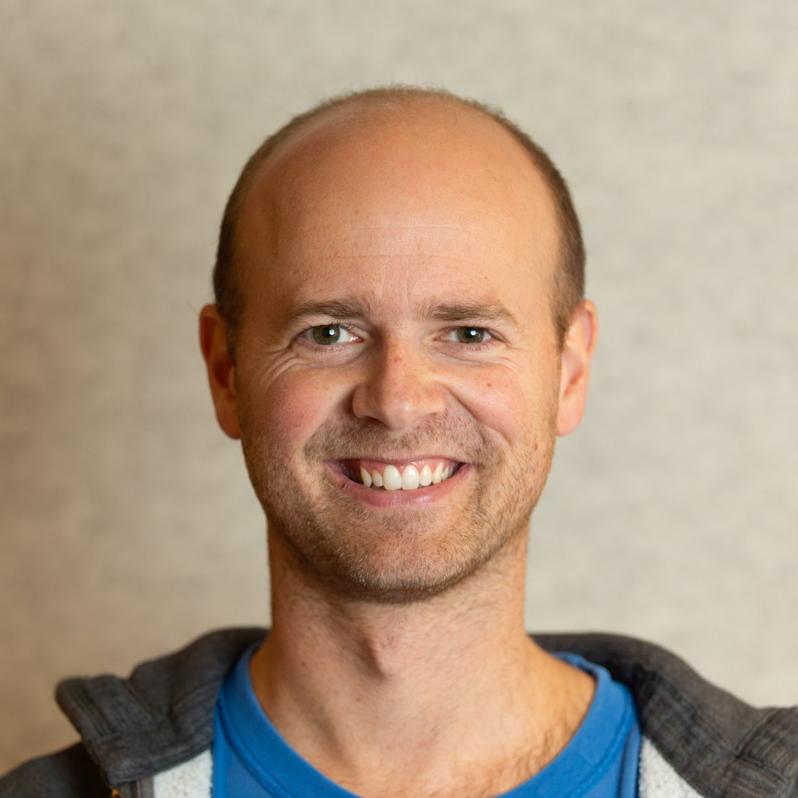
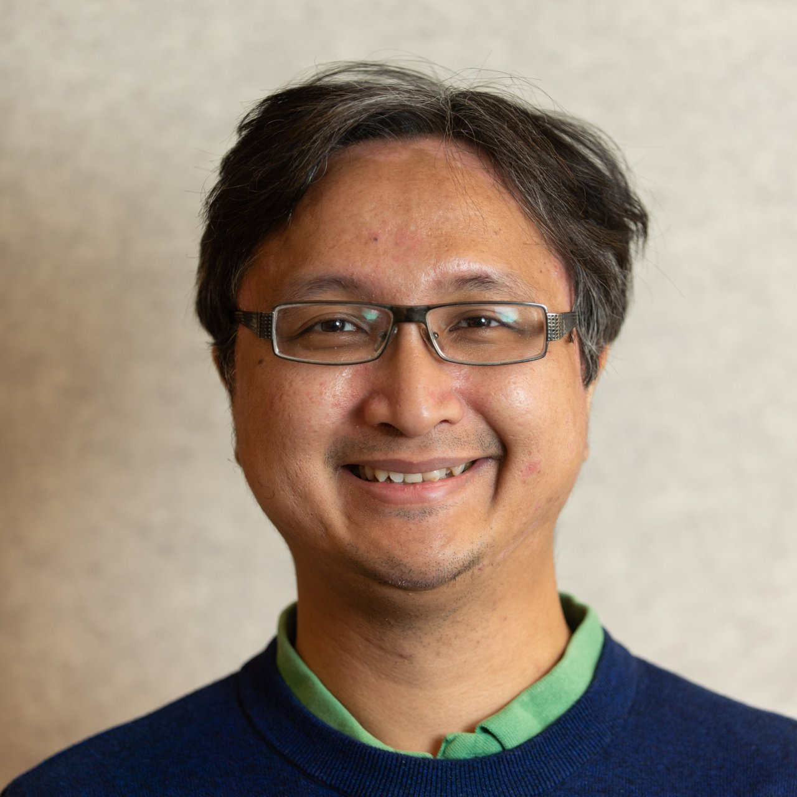

Radix aims to be _the_ platform to build and deploy code within Equinor. It can only be that if it helps Equinor developers — that's you — succeed.

Of course, Radix is developed and maintained by Equinor developers as well. That means we want to work together to build the best platform we can. If you have problems or suggestions, we want to hear from you! It helps

# On Slack

If you'd like to discuss the platform, features or improvements, head on to the main [Omnia Radix channel](https://equinor.slack.com/messages/C8U7XGGAJ). Stuck? App not building? Don't understand the docs? the place to ask is in [the support channel](https://equinor.slack.com/messages/CBKM6N2JY).

# On GitHub

If you think you found a bug, or you have a concrete proposal, [log an issue](https://github.com/equinor/radix-platform/issues) on GitHub. We have multiple repositories, but all issues are tracked in **radix-platform**.

# The Radix team

We are based in Vassbotnen in Stavanger. If you see us on the corridor, say hello!
  

Kjell Erik Reed Anda    - Product Owner & Developer  
  
  
Dafferianto Trinugroho - Developer       Marko Horvat - Infrastructure  
          
  
Joakim Hagen - Developer                 Christer Time - Infrastructure  
                                           
  
Sergey Smolnikov - Developer  
     
  
Ole Joar Austbø Moi - Developer  
  
  
Elsa Mâyrä Irgens     - Team Leader  
  

