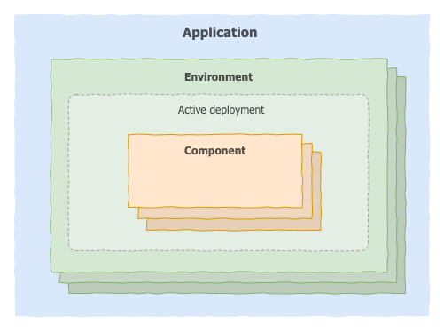
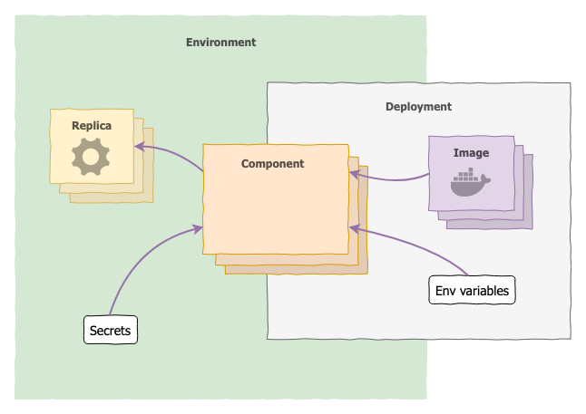
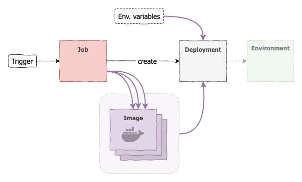

# Running code in Radix

## Application

Applications are the highest level of objects that can be created in Radix — all other objects are contained within them.

An application declares all its [components](#component); this allows for them to be deployed and managed together within [environments](#environment). For instance, `front-end` and `back-end` components would in principle be part of the same application.

The components of an application don't need to share aspects like coding language, runtime, or system resources — they are just running processes. But within an application, components should in principle relate closely by communicating with each other.

The basic configuration for an application (the _application registration_) is composed of a **name**, the URL of a **GitHub repository**, and **access control** configuration (i.e. which Active Directory groups can administer the application in Radix). The remainder of the configuration is provided by the [`radixconfig.yaml` file](../reference-radix-config/), which is kept in the root of the application GitHub repository.

## Environment

An environment is an isolated area where all of an application's [components](#component) run. It is meant to compartmentalise an instance of the application, and can be used to provide that instance to users.

A typical setup is to create two environments, `development` and `production` — the former can be used for testing and showcasing features under development, and the latter is the "live" application that users rely on. Any (reasonable) number of environments is allowed in Radix; you can use these in a way that best fits your development and deployment [workflow](../../guides/workflows/).

Within an environment, components should address each other over the network by using just their names, instead of IP addresses or FQDNs. For instance, if you have two components, `api` and `worker` (listening on port 3000 for HTTP calls), the API can communicate with `http://worker:3000/some-endpoint`.

> If you ❤️ Kubernetes, you'll be happy to know that Radix environments are actually just [K8s namespaces](https://kubernetes.io/docs/concepts/overview/working-with-objects/namespaces/).

Environments are targets for [deployments](#deployment); at any time an environment will contain at most one _active deployment_. When a deployment is made active, all components within the environment are shut down and new ones are started, using the images defined in the deployment.

Environments (not deployments) also define any [secrets](#secret) that are required by the running components. Those secrets are kept in the environment when the active deployment is changed, and applied to the new components.

## Component

A component represents a standalone process running within an [environment](#environment) in a Radix application. Components are defined in the [`radixconfig.yaml` file](../reference-radix-config/#components), but they are only instantiated by [deployments](#deployment), which specify the Docker image to use. A component can have one or more running [replicas](#replica), depending on its configuration.

> Familiar with Docker or containers? A Radix component can be thought of as Docker image, and replicas as containers running that image.

If a component's `publicPort` is defined, endpoints are made available on the public Internet for each environment the component is deployed to. This allows connections via HTTPS into Radix, which are routed internally to an HTTP endpoint on the component. The domain name for the public endpoint is auto-generated from the component, environment, and application names: `https://[component]-[application]-[environment].[cluster-name].radix.equinor.com`.

> The `[cluster-name]` part of the domain refers to the current Radix cluster. This should become a static name in the future.

Components can further be configured independently on each environment. Besides [environment variables](#environment-variable) and [secrets](#secret), a component can have different resource usage and monitoring settings.

## Replica

A replica is a running instance of a [component](#component). As a normal process, it can write to the standard output (`stdout`), which is made available for inspection by Radix.

If a replica terminates unexpectedly, a new one is started so that the component will maintain the specified number of replicas running (by default, this number is one). Each replica is started with the exact same configuration.

## Environment variable

A component can use any number of environment variables; the values of these are specified per [environment](#environment) in the `radixconfig.yaml` file.

Note that each component has its own set of environment variables. It's quite possible (though maybe not great practice) to have two different components in the same environment using variables with the same name (e.g. `MY_ENV_VAR`), each with different values.

In addition to the user-defined variables, a series of variables prefixed with `RADIX_*` are made available to all components. Check the [variables section](../reference-radix-config/#variables) of the `radix_config.yaml` reference for details.

## Secret

Secrets are made available to components as environment variables. Unlike [environment variables](#environment-variable), secrets are defined in each [environment](#environment), and components specify the name of the secret they require (not the value). This means that the secrets remain in their environment regardless of the specific active [deployment](#deployment).

For each environment, a secret can be **consistent** or **missing**. A missing secret will prevent the component from starting up. To populate a secret, navigate to each environment within the Web Console, where required secrets and their state are displayed.

# Continuous integration and deployment

## Job

Jobs are the core of the continuous integration/deployment (CI/CD) capabilities of Radix. Jobs perform tasks, which can causes changes in an application, its environments, and components. Depending on the type of job (its [pipeline](#pipeline)), different behaviours can be expected.

Jobs consist of a series of _steps_, run either in parallel or sequentially (this is also defined by the pipeline). Each step is a stand-alone process, and its output can be inspected.

## Pipeline

A pipeline defines a type of job. There are currently three types of pipeline in Radix:

### The `build-deploy` pipeline

This is triggered by a commit in GitHub to a branch mapped to an environment. In turn, this causes all components to be rebuilt and a new deployment to be created in the appropriate environment. If many components are built from the same source, then one multi-component image is built for all components. If there are several multi-components in the config, the multi-component images will be indexed.

#### Scanning images for security issues
Before the deployment is done, after a build, the image is scanned for security-related issues using the tool [trivy](https://github.com/aquasecurity/trivy). This scan will be a seperate step in the pipeline and the result will be logged in the step. Please note that the job will not fail if the result contains HIGH and/or SEVERE issues. However every developer should investigate and fix any security issues.

### The `build` pipeline

Exactly the same as the `build-deploy` pipeline, but a deployment is not created at the end of the build. Useful for testing the ability to build the code, run tests, etc.

### The `promote` pipeline

Used to duplicate an existing [deployment](#deployment) from one environment into another (or to redeploy an old deployment). You can read more about it in the [promotion guide](../../guides/deployment-promotion).

## Deployment

Deployments are created by some types of [job](#job). A deployment defines the specific image used for each [component](#component) when it runs in an [environment](#environment). Deployments thus serve to aggregate specific versions of components, and make them easy to deploy together.

[Environment variables](#environment-variable) (but not [secrets](#secret)) are also stored within a deployment.

> See [this](../../guides/deploy-only/) guide on how to set up your application to only use the continuous deployment (CD) on Radix

# Publishing applications

## Default alias

Each application can have one specific component in one specific environment set as the _default alias_. This component is assigned a domain name in the format `[application].app.radix.equinor.com` and assigned a certificate. This domain can be used as the public URL for accessing the application.

The default alias is configured by the [`dnsAppAlias` setting](../reference-radix-config/#dnsappalias) in the `radixconfig.yaml` file.

## External (custom) alias

It is possible to have multiple custom DNS aliases (i.e. to choose your own custom domain) for the application. The _external alias_ needs to point to a component [marked as public](../reference-radix-config/#publicport). This external alias can be any domain name, which can be used as the public URL for accessing the application, as long as a valid certificate for the domain is applied.

The external alias is configured by the [`dnsExternalAlias` setting](../reference-radix-config/#dnsexternalalias) in the `radixconfig.yaml` file.
