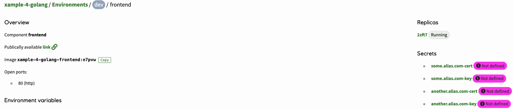
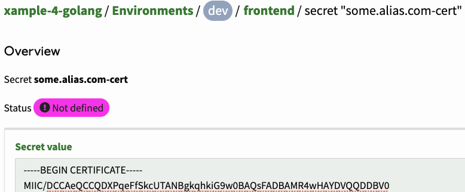

# Introduction

We have introduced a new configuration in the `radixconfig.yaml` file for having user defined aliases, provided developers bring the corresponding certificate. For information on how to configure that, see the documentation for the [`dnsExternalAlias` setting](../../reference-radix-config/#dnsexternalalias) in the `radixconfig.yaml` file.

# How-to set certificate

The TLS certificate consists of a cert part and a private key. Once the external alias has been defined, the secrets for the TLS certificate parts will be listed as secrets on the component.

Set the cert part of the TLS certificate and save.

Set the private key part of the TLS certificate and save.

# Whats next

We will do some work to list the defined external aliases in a future feature.
