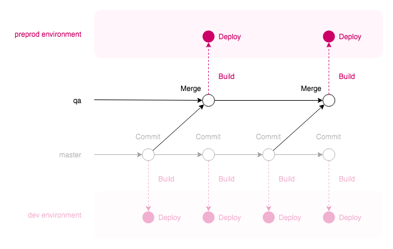
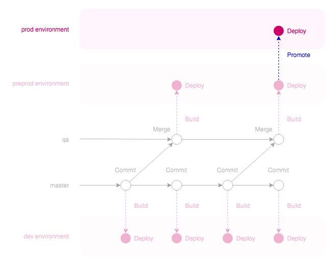

# Configuring an app

In this guide we'll set up an application together. Here's what we need to get our application in Radix:

- A GitHub repository for our code (only GitHub is supported at the moment)
- A `radixconfig.yaml` file that defines the running environments. This must be in the root directory of our repository.
- At least one `Dockerfile` that builds and serves our application. We can have several of these files: one per component, in separate directories (e.g. a "front-end" component and a "back-end" component).

We will go over these points below.

[Introduction to Radix video](https://statoilsrm.sharepoint.com/portals/hub/_layouts/15/PointPublishing.aspx?app=video&p=p&chid=653b6223-6ef5-4e5b-8388-ca8c77da4c7a&vid=3a64412f-0227-489d-9fda-f5f9845aacae)

## The repository

All of our **components must be in the same repository**. A component is a piece of code that has its own build and deployment process: for instance a "front end" served by Nginx and a "back end" running on Node.js would be two components. Components are built in parallel from the same repository and deployed together into an environment. There is currently no concept of a multi-repository application.

The way we use branches and tags in our repository depends on what type of workflow we use. You can read more about the choices available in the [workflows](#workflows) section — but let's continue with setting up for now.

## The `radixconfig.yaml` file

In the root of our repository we need a `radixconfig.yaml` file: this is the Radix configuration, which specifies how our application is built and deployed.

> Radix only reads `radixconfig.yaml` from the `master` branch. If the file is changed in other branches, those changes will be ignored.

If you are unfamiliar with YAML, it is fine to write the configuration as JSON instead — just keep the same filename.

Here is a simple example of the file:

```yaml
apiVersion: radix.equinor.com/v1
kind: RadixApplication
metadata:
  name: my-cool-app
spec:
  environments:
    - name: dev
      build:
        from: master
    - name: prod
  components:
    - name: main
      src: "."
      public: true
      ports:
       - name: http
         port: 80
```

The same, but as JSON:

```json
{
   "apiVersion": "radix.equinor.com/v1",
   "kind": "RadixApplication",
   "metadata": { "name": "myapp" },
   "spec": {
      "environments": [
         { "name": "dev", "build": { "from": "master" } },
         { "name": "prod" }
      ],
      "components": [
         {
            "name": "main",
            "src": ".",
            "public": true,
            "ports": [
               { "name": "http", "port": 80 }
            ]
         }
      ]
   }
}
```

A breakdown of the configuration above:

- Our application is called `myapp`
- There are two environments, `dev` and `prod`, and only one component, `main`
- Commits to the `master` branch will trigger a build and deployment of the application to the `dev` environment. We can use this behavior to build a [workflow]()
- Radix will look for the `Dockerfile` for the `main` component in the root directory of the repository
- Once `main` is built, it will be exposed on the internet on port 80 on each environment it is deployed to (in `dev`, for instance, it will have a domain name like `main-myapp-dev.CLUSTER_NAME.radix.equinor.com`)

The full syntax of `radixconfig.yaml` is explained in [Radix Config Explained]().

## A `Dockerfile` per component

Each component in Radix is built into a Docker image. Images for all components are deployed as containers running in an environment. To do this, Radix requires a `Dockerfile` for each component.

If we organize our repository with this structure, for instance:

```
/
├─ fe/
│  ├─ Dockerfile
│  └─ *frontend component code*
│
├─ be/
│  ├─ Dockerfile
│  └─ *backend component code*
│
└─ radixconfig.yaml
```

In `radixconfig.yaml` we can define the following components:

```yaml
  components:
    - name: frontend
      src: "./fe"
    - name: backend
      src: "./be"
```

Note the `src` property for each component: this is the path to the directory containing the `Dockerfile` for that component. Radix will try to build the image within that directory.

The `Dockerfile` should define a **multi-stage build** in order to speed up the builds and make the resulting image as small as possible. This means that we can decouple the build and deployment concerns. Here is an example for a simple Node.js single-page application:

```docker
FROM node:carbon-alpine as builder
WORKDIR /app
COPY package*.json ./
RUN npm install
COPY . .
RUN npm run build

FROM nginx:1.14-alpine
WORKDIR /app
COPY --from=builder /app/build /app
COPY nginx.conf /etc/nginx/conf.d/default.conf
```

Note how the first section uses a large image (`node`) which has the dependencies needed to build the component. In the second stage, the built files are copied into a small image (`nginx`) to serve them without all the build dependencies.

There are other examples of how to create an efficient `Dockerfile` in [the documentation](#dockerfile-examples-and-best-practice).

## Registering the application

We are now ready to register our application using the [Radix Web Console](https://console.dev.radix.equinor.com). Follow the instructions there to integrate the GitHub repository with Radix.

Remember that we can always change the `radixconfig.yaml` file and the `Dockerfiles` after registration to change how the application builds and deploys.

# Docker builds

recommendations when creating a dockerfile (e.g. multistage, base images, testing inside container, ..)

# Workflows

## Overview

In Radix, our development workflow can be modelled to match our needs. It is possible to use, for instance [Git Flow](https://nvie.com/posts/a-successful-git-branching-model/) or [Trunk-based development](https://paulhammant.com/2013/04/05/what-is-trunk-based-development/). Radix gives us a couple of tools to shape our workflow: **branch-environment mapping** and **deployment promotion**.

If we **map** a git branch to an environment, commits to that branch will trigger a build and deployment to the specified environment. For instance, a `dev` environment might be built and deployed from `master`, while a `prod` environment can be built and deployed from the `production` branch. Branches and environments that are not mapped are ignored and do not trigger automatic builds or deployments.

**Promotion** allows us to take an existing deployment in an environment, and deploy it in another. For instance, take what is currently running in the `preprod` environment and place it in `prod`.

It is fine to combine these features to produce the workflow that we want. For instance, we can automatically build and deploy `master` to the `dev` environment, and the `release` branch to `preprod`. We can then manually promote the deployment in `preprod` to the `prod` environment.

## An example

Let's go over the example above in more detail. We are continuously working on `master`, and we want commits here to be automatically deployed to `dev`:


In `radixconfig.yaml` we define this behaviour like so:

```yaml
spec:
  environments:
    - name: dev
      build:
        from: master
```

Let's create a `qa` branch, which builds and deploys to a `preprod` environment. When `master` is in a "ready-to-test" state, we will merge `master` to `qa`.



Here's how `radixconfig.yaml` looks now:

```yaml
spec:
  environments:
    - name: dev
      build:
        from: master
    - name: preprod
      build:
        from: qa
```

Finally, if `preprod` is working fine, we can then manually **promote** the deployment to the `prod` environment:



This is our final workflow configuration in `radixconfig.yaml` (note that `prod` is not mapped — we will promote deployments manually via the Radix Web Console):

```yaml
spec:
  environments:
    - name: dev
      build:
        from: master
    - name: preprod
      build:
        from: qa
    - name: prod
```

# Monitoring

For more information on monitoring see [link]()

## How to configure monitoring on Radix
