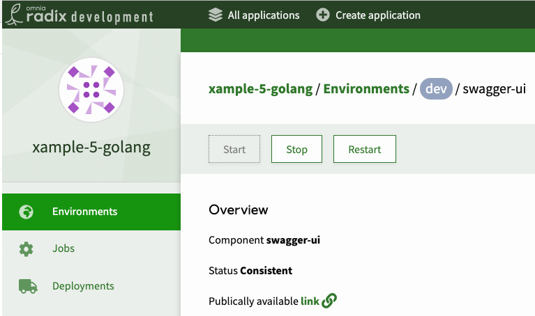

# Overview

Stop, Start and Restart of a running component can be done in the Web console, when special circumstances requires it (i.e. after having updated a secret), even though the recommended approach is to change the configuration in `radixconfig.yaml` 

> A new deployment will apply the configuration from the `radixconfig.yaml` and may overrun the actions performed in the Radix web console

# Stopping

*Stopping* the component will set the number of replica to 0 for the *active deployment*. Note that if you make a new deployment to the environment, by pushing a change to the branch mapped to the environment, and the replica configuration in the `radixconfig.yaml` is not  0 for the applicable component, it will start the component.

# Starting

*Starting* the component will set the number of replica to the number set in the `radixconfig.yaml` for the *active deployment*.

# Restarting

*Restarting* the component will make a rolling restart of the *active deployment*. That means that the application will be responsive during the enire restart, just as with [rolling updates](../../docs/topic-rollingupdate/).
