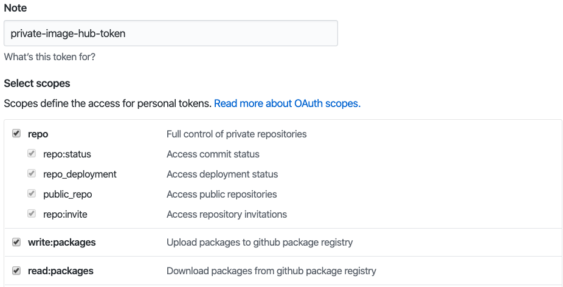

Disclaimer: Please seek advice elsewhere on wether or not github actions and/or github package repository is the right option for you. Both features are new and we have too little experience as an organization to make any recommendations, both in terms of robustness and in terms of cost. A private Azure container registry (ACR) would for instance allow you to set it up with a service account, rather than using your personal account. This document is meant to be a user guide on how to combine these with Radix, as one of many alternatives for running CI outside of Radix.

# Use master branch as a config branch

Set up both environments to deploy from master branch. Both client component and server component has a {tagName} appended to the image string, in order to use the imageTagNam field in environment config.

```yaml
apiVersion: radix.equinor.com/v1
kind: RadixApplication
metadata:
  name: <your app name>
spec:
  environments:
  - name: dev
    build:
      from: master
  - name: prod
    build:
      from: master
  components:
  - name: client
    image: docker.pkg.github.com/equinor/<repository>/<client-image>:{tagName}
    environmentConfig:
    - environment: dev
      imageTagName: to-be-changed
    - environment: prod
      imageTagName: to-be-changed
    ports:
    - name: http
      port: 80
    public: true
  - name: server
    image: docker.pkg.github.com/equinor/<repository>/<server-image>:{tagName}
    environmentConfig:
    - environment: dev
      imageTagName: to-be-changed
    - environment: prod
      imageTagName: to-be-changed
    ports:
    - name: http
      port: 8000
    public: false
  dnsAppAlias:
    environment: prod
    component: client
  privateImageHubs:
    docker.pkg.github.com:
      username: <your username>
      email: <your email>
```

# Building using github actions

Create a workflow file under the folder .github/workflows folder. In below workflow we generate branch latest image tags (i.e. master-latest or release-latest). Any new deployment to environment will trigger a new pull of the image.

```yaml
name: <name of the workflow>
on:
  push:
    branches:
      - development
      - release
jobs:
  build:
    name: build-push-gpr
    runs-on: ubuntu-latest
    steps:
      - uses: actions/checkout@v1

      - name: build client component
        run: |
          docker build -t docker.pkg.github.com/equinor/<repository>/<client-image>:${GITHUB_REF##*/}-${{ github.sha }} ./client/

      - name: build server component
        run: |
          docker build -t docker.pkg.github.com/equinor/<repository>/<server-image>:${GITHUB_REF##*/}-${{ github.sha }} ./server/

      - name: Push the image to GPR
        run: |
          echo ${{ secrets.PRIVATE_TOKEN }} | docker login docker.pkg.github.com -u <your user name> --password-stdin
          docker push docker.pkg.github.com/equinor/<repository>/<client-image>:${GITHUB_REF##*/}-${{ github.sha }}
          docker push docker.pkg.github.com/equinor/<repository>/<server-image>:${GITHUB_REF##*/}-${{ github.sha }}
```

# Changing radixconfig on builds from development and release branch, and commit to master

To fully automate deployment to Radix, we need to commit the new image tag to master branch for the corresponding environment. In my example I created a python script to do that. In the script the mapping of branch to environment is added since the Radix config states both environments derive from master branch.

```python
import sys
from ruamel.yaml import YAML

# Gets component index from component name
def getEnvironmentFromBranch(branch):
  if branch == 'development':
    return 'dev'

  elif branch == 'release':
    return 'prod'

  return ''

# Gets component index from component name
def getComponentIndex(components,name):
  componentIndex = 0
  for component in components:
      if component['name'] == name:
          return componentIndex

      componentIndex += 1

  return -1

# Gets environment index from environment name
def getEnvironmentIndex(environments,name):
  environmentIndex = 0
  for environment in environments:
      if environment['environment'] == name:
          return environmentIndex

      environmentIndex += 1

  return -1

# Main
component = str(sys.argv[1])
branch = str(sys.argv[2])
newTag = str(sys.argv[3])

inp_radixconfig = open("radixconfig.yaml").read()
yaml = YAML()
content = yaml.load(inp_radixconfig)

environment = getEnvironmentFromBranch(branch)
if environment != '':
  componentIndex = getComponentIndex(content['spec']['components'], component)
  environmentIndex = getEnvironmentIndex(content['spec']['components'][componentIndex]['environmentConfig'], environment)

  content['spec']['components'][componentIndex]['environmentConfig'][environmentIndex]['imageTagName'] = newTag

  outp_radixconfig = open("radixconfig.yaml","w")
  yaml.dump(content, outp_radixconfig)
  outp_radixconfig.close()
```

With the python script in the repository, you can add the following steps to your github actions workflow.

```yaml
      - uses: actions/checkout@v2-beta
        with:
          ref: master

      - name: Modify radixconfig tag for branch
        run: |
          # Install pre-requisite
          python -m pip install --user ruamel.yaml

          # Update client tag for development environment
          python modifyTag.py client ${GITHUB_REF##*/} ${GITHUB_REF##*/}-${{ github.sha }}

          # Update server tag for development environment
          python modifyTag.py server ${GITHUB_REF##*/} ${GITHUB_REF##*/}-${{ github.sha }}

      - name: Commit radixconfig to master branch
        run: |
          git config --global user.name '<your username>'
          git config --global user.email '<your username>@users.noreply.github.com'
          git remote set-url origin https://x-access-token:${{ secrets.PRIVATE_TOKEN }}@github.com/${{ github.repository }}
          git commit -am ${GITHUB_REF##*/}-${{ github.sha }}
          git push origin HEAD:master
```

# Configure Radix to use github package

The following config in your radixconfig.yaml file will allow you to set a secret in the web console to pull images from github package repository:

```
  privateImageHubs:
    docker.pkg.github.com:
      username: <your github user>
      email: <your email>
```

Go to developer settings in Github to generate an access token (Enable SSO in order to have it be able to access Equinor organization):


Set the privileges to allow it to create packages:



Go to Radix web console to set the secret:


# Example

See this [example](https://github.com/equinor/radix-example-deploy-only) for how this can be set up.