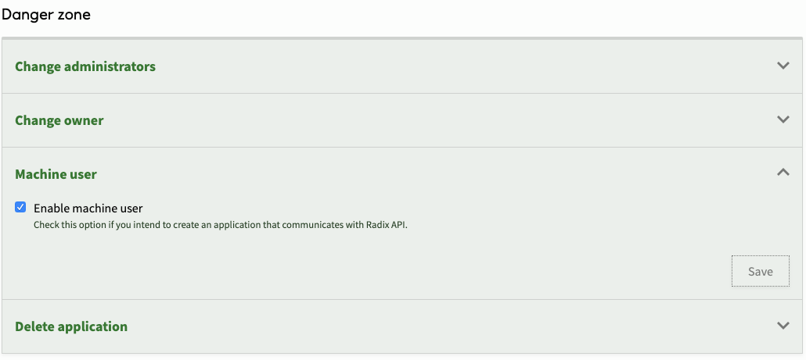
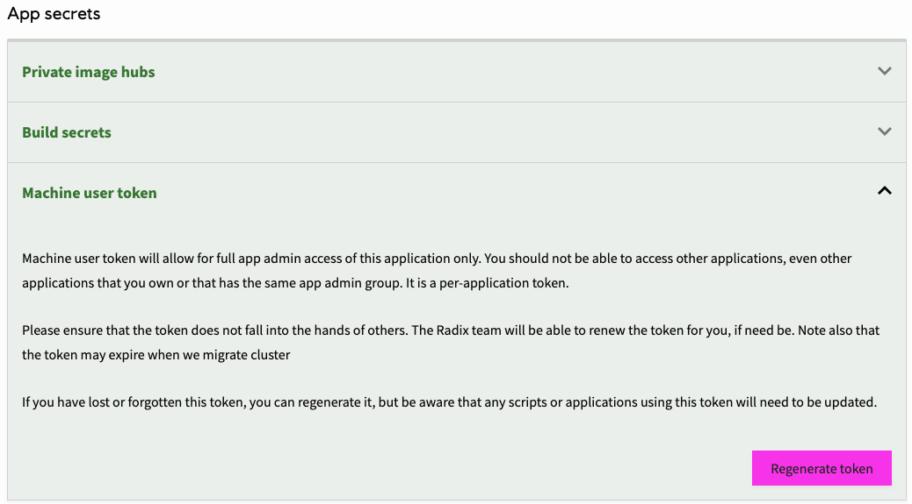
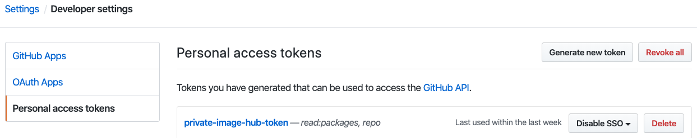
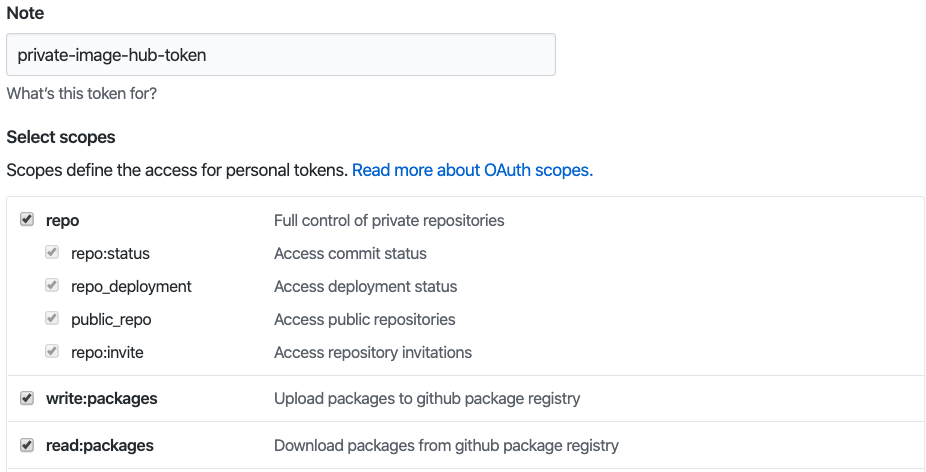
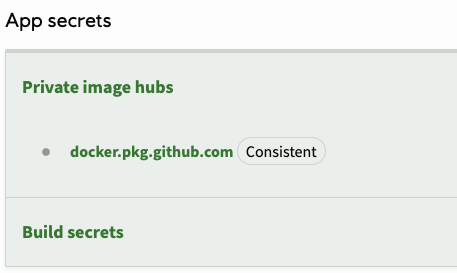

There might be several reasons why you would opt against using Radix as a CICD platform, and just using the CD part of Radix:

- Your application consists of a set of components (i.e. micro services), with source code hosted in separate repositories
- Your application depends on different resources, and the deployment to Radix needs to be orchestrated
- Your team has more advanced needs of the CI i.e. test reports, git lfs

# Configuring the app

Same as with any other application deployed to Radix, a deploy-only application will need:

- A GitHub repository for the code (only GitHub is supported at the moment)
- A `radixconfig.yaml` file that defines the running environments, which must be in the root directory of the repository

These points is described below

# The repository

Unlike a regular Radix application, for a deploy-only application you have two options on how to structure your repositories. You can choose to have:

- The Github repository which act as a pure configuration repository. That is, source code for the different components resides in other repositories
- The `radixconfig.yaml` is in the source code repository

The documentation will use the second option and this [example repository](https://github.com/equinor/radix-example-arm-template)

# The `radixconfig.yaml` file

> Radix only reads `radixconfig.yaml` from the branch we set as the `Config Branch` in the application registration form. If the file is changed in other branches, those changes will be ignored. The `Config Branch` must be mapped to an environment in `radixconfig.yaml`

The major difference between a deploy-only `radixconfig.yaml` and a regular Radix application `radixconfig.yaml`, is the lack of components' `src` property, as there is nothing to build on Radix. Rather it uses an `image` property, alongside a separate `imageTagName` property per environment, as shown below:

```yaml
apiVersion: radix.equinor.com/v1
kind: RadixApplication
metadata:
  name: radix-example-arm-template
spec:
  environments:
    - name: qa
      build:
        from: master
    - name: prod
      build:
        from: release
  components:
    - name: api
      image: docker.pkg.github.com/equinor/radix-example-arm-template/api:{imageTagName}
      ports:
        - name: http
          port: 3000
      publicPort: http
      environmentConfig:
        - environment: qa
          imageTagName: master-latest
        - environment: prod
          imageTagName: release-39f1a082
  privateImageHubs:
    docker.pkg.github.com:
      username: <some GitHub user name>
      email: <some email>
```

In the `radixconfig.yaml` above, there are two tagging strategies;

- Using a latest tag (i.e. master-latest)
- Using a dynamic tag (i.e release-39f1a082)

A dynamic tag in this context means that there is a new tag produced for every build, either referring to the release tag, or the commit sha (in the case above) or any other attributes that uniquely identifies what the image is produced from. The dynamic tag will give better control over what runs in the environment, and it also allows for promoting older deployments in case there is a need for a rollback.

A static tag will not permit radix to update an existing deployment by relying on changes to `imageTagName` to pull a new image. To force radix to pull a new image from the image-hub, the component must be restarted using the component page on the web-console or restart call to the [API](https://api.radix.equinor.com/swaggerui/#/component/restartComponent) or [CLI](https://github.com/equinor/radix-cli). There is currently no log trace of components starting and stopping. If this is necessary, one may call `deploy-only` once on the application before `restart` on each component using static tags.

The second part of the `radixconfig.yaml` which distinguishes itself from a regular radix application is the [`privateImageHubs` property](../../docs/reference-radix-config/#privateImageHubs). In short, it will allow for the image produced outside of Radix to be pulled down to the Radix cluster.

Also what can be said about the configuration above is the branch to environment mapping. Since build of components happens outside of Radix the build -> from configuration seems unnecessary. You could, especially if the repository for the Radix application is a mere configuration repository, leave environments unmapped. We will explain later why we, in this example, have opted to have a branch-environment mapping.

The full syntax of `radixconfig.yaml` is explained in [Radix Config reference](../../docs/reference-radix-config/).

# Registering the application

Registering the Radix application follows the pattern of a regular Radix application. The only difference is that we skip adding a web-hook to Radix. We then avoid that the application is built and deployed to Radix, using the Radix CI. The mechanism for deploying to Radix will be described in the next section.

# Machine user token

In a deploy-only scenario you will tell us when to deploy, rather than having the web-hook tell us when changes have occurred in the repository, as for other Radix applications. In order to do that, you will make calls to the Radix API. In order to do that you have two approaches:

- You can authenticate with any user in the application `Administrators` group, and get a token of that user (i.e. az account get-access-token) to communicate with the Radix API
- You can use the machine user token we provide you, as long as you have enabled the machine user to be created for your application

> The machine user token can be obtained on the application `Configuration` page, after first having enabled the machine user. Also note that if you enable the machine user for an existing application, you may need to re-trigger a deploy to Radix to have the access for the machine user propagated properly





By pressing `Regenerate token` button, you invalidate the existing token and get new token which can be copied to your clipboard.

> Note that the machine user token is a longed lived token with access to all operations that an application administrator has (i.e. deleting the application, setting secrets). Please make efforts not to have this token fall into the wrong hands.

# Making calls to Radix

With the access token you can make calls to our API through either:

- Calling the API directly ([production API](https://api.radix.equinor.com/swaggerui/) or [playground API](https://api.playground.radix.equinor.com/swaggerui/)), by passing the bearer token (i.e. curl -X GET --header "Authorization: Bearer \$token")
- Calling the API though functions in the [Radix CLI](https://github.com/equinor/radix-cli), which allows for simpler access to the API
- Calling the API through [Radix GitHub Actions](https://github.com/equinor/radix-github-actions). If you have opted for GitHub Actions as your CI tool, then calling the Radix API indirectly through the Radix CLI using the Radix GitHub Actions can be done. It allows for simpler access to the CLI in your actions workflow.

# Building using other CI (i.e. GitHub Actions)

To create a GitHub Actions you create a workflow file in the folder .github/workflows. In the sample workflow below we will build new images for master (qa environment) and release (prod environment) branches:

```yaml
name: CI

on:
  push:
    branches:
      - master
      - release

jobs:
  build:
    name: deploy
    runs-on: ubuntu-latest
    env:
      APP_SERVICE_ACCOUNT_TOKEN: ${{ "{{ secrets.K8S_CREDENTIALS " }}}}
    steps:
      - uses: actions/checkout@v1
      - name: Set default image tag
        run: |
          echo ::set-env name=IMAGE_TAG::$(echo ${GITHUB_REF##*/}-latest)
      - name: Override image tag for prod environment
        if: github.ref == 'refs/heads/release'
        run: |
          echo ::set-env name=IMAGE_TAG::$(echo ${GITHUB_REF##*/}-${GITHUB_SHA::8})
      - name: Build API component
        run: |
          docker build -t docker.pkg.github.com/equinor/radix-example-arm-template/api:$IMAGE_TAG ./todoapi/
      - name: Push the image to GPR
        run: |
          echo ${{ "{{ secrets.PRIVATE_TOKEN " }}}} | docker login docker.pkg.github.com -u <any-github-user-name> --password-stdin
          docker push docker.pkg.github.com/equinor/radix-example-arm-template/api:$IMAGE_TAG
      - name: Prepare for committing new tag to radix config on master
        uses: actions/checkout@v2-beta
        with:
          ref: master
      - name: Modify radixconfig tag for production on master branch
        if: github.ref == 'refs/heads/release'
        run: |
          # Install pre-requisite
          python3 -m pip install --user ruamel.yaml
          python3 hack/modifyTag.py api ${GITHUB_REF##*/} $IMAGE_TAG
          git config --global user.name 'ingeknudsen'
          git config --global user.email 'ingeknudsen@users.noreply.github.com'
          git remote set-url origin https://x-access-token:${{ "{{ secrets.PRIVATE_TOKEN  " }}}}@github.com/${{ "{{ github.repository " }}}}
          git commit -am $IMAGE_TAG
          git push origin HEAD:master
      - name: Get environment from branch
        id: getEnvironment
        uses: equinor/radix-github-actions@master
        with:
          args: >
            get config branch-environment
            --from-config
            -b ${GITHUB_REF##*/}
      - name: Deploy API on Radix
        uses: equinor/radix-github-actions@master
        with:
          args: >
            create job
            deploy
            --context development
            --from-config
            -e ${{ "{{ steps.getEnvironment.outputs.result " }}}}
            -f
```

### Updating deployments on static tags

As part of deploying an application to kubernetes, Radix reads the radixconfig.yaml file and based on this creates kubernetes resources. If there are no changes to the radixconfig.yaml file, there will be no changes to the underlying kubernetes resources. As a default kubernetes will then do nothing. 

When utilizing static tags, there will often be no changes to radixconfig.yaml when performing a deployment. Kubernetes will then continue to run its existing containers after deployment. 

This default behavior can be overwritten in radixconfig.yaml by setting flag `alwaysPullImageOnDeploy` on component level. When this flag is set to true, a deployment will always lead to a change in the underlying kubernetes resource, which again lead to kubernetes pulling the newest image from the container registry. 

```yaml
spec:
  environments: ...
  components:
    - name: api
      image: docker.pkg.github.com/equinor/my-app/api:latest
      alwaysPullImageOnDeploy: true
```

## Workflow secrets

There are a couple of GitHub secrets the workflow make use of:

- `K8S_CREDENTIALS` - This is the token used for accessing Radix. In this example we are using the machine user token provided with the application. The name of the secret can be any name. However, the environment variable needs to be `APP_SERVICE_ACCOUNT_TOKEN`, as this is what the Radix CLI expect the environment variable to be named
- `PRIVATE_TOKEN` - The private token is used for publishing a package to GitHub package repository. The name is irrelevant. It is a personal access token that you configure for your GitHub user. In this example we use the same token for producing the package, as we do for giving Radix access to pull the image to the cluster

## Configuring a personal access token

Go to developer settings in GitHub to generate an access token (Enable SSO in order to be able to access GitHub Equinor organization):



Set the privileges to allow it to create packages:



## The workflow

In the above workflow we have a series of steps. They are:

- `Set default image tag` - In the example we have a fixed tag for qa environment (i.e. master-latest) while we have a dynamic tag for prod environment. This step sets the default tag for qa environment, or any other environment we choose to add with a latest tagging strategy
- `Override image tag for prod environment` - Gives a dynamic image tag for production
- `Build API component` - Building is now done outside of Radix
- `Push the image to GPR` - Pushes a package to Github package repository using the `PRIVATE_TOKEN` (personal access token)
- `Prepare for committing new tag to radix config on master` - Since we are using the dynamic tagging for prod environment, we have to commit to master a version of the `radixconfig.yaml` holding the newly produced tag. This step checks out master branch of the repository
- `Modify radixconfig tag for production on master branch` - This step calls a [custom script](https://github.com/equinor/radix-example-arm-template/blob/master/hack/modifyTag.py) to modify the tag in `radixconfig.yaml` and the commits and push the change on master
- `Get environment from branch` - This steps calls a utility function in the CLI for obtaining the environment based on the current brach from the branch-environment mapping in the `radixconfig.yaml` of the repository
- `Deploy API on Radix` - This step calls the CLI function, which calls the deploy pipeline function of the Radix API for running the deploy pipeline. It uses the output of the previous step to tell Radix which environment it should deploy to. Note that is using `development` context to contact the API in the development cluster. Similarly if context is `playground` it will contact API in playground cluster. If you remove this entirely, it will default to `production` context

> Note that the push of the dynamic image tag of the prod environment to master branch creates a side-effect of building the QA environment again, as this is mapped to master. This shows, master branch should not be mapped to any environment (neither in the `radixconfig.yaml`, nor in the GitHub Actions workflow)

> `--from-config` is an argument to `radix-cli` to tell it that there is an radixconfig in your repository that it can get information from, such as application name or branch mapping

# Configure Radix to use GitHub package

Go to the application `Configuration` page to set the secret, which will be the personal access token you have created with access to read packages in the Equinor organization. This gives Radix access to pull any package in the Equinor organization referred to in the `radixconfig.yaml`:



# Coordinating workflow

In the example repository that we have used for this documentation we are setting secrets in Radix to be values associated with resources in Azure created for the application. The additional workflow steps are shown below. They are:

- Log into Azure - See [here](https://github.com/Azure/login) for documentation on what the `AZURE_CREDENTIALS` should contain
- `Get instrumentation key and connection string` - Obtains and passes on to subsequent steps the secret values to be set in Radix. Note that you should `add-mask` to any secret that you pass on in the workflow, to ensure that it is not exposed in the log of the workflow
- `Set instrumentation key as secret` - Takes one of the secrets passed on from the previous steps and set the secret for the application, for the environment this branch is mapped to (in the `development` cluster)
- `Set connection string as secret` - Sets the second secret value

```yaml
- uses: Azure/login@v1
  with:
    creds: ${{ "{{ secrets.AZURE_CREDENTIALS " }}}}
- name: Get instrumentation key and connection string
  id: getSecrets
  run: |
    RESOURCE_GROUP=db-api-radix-${{ "{{ steps.getEnvironment.outputs.result " }}}}
    INSTRUMENTATIONKEY=$(az group deployment show -g ${RESOURCE_GROUP} -n azuredeploy --query properties.outputs.appInsightInstrumentationKey.value)
    CONNECTION_STRING=$(az group deployment show -g ${RESOURCE_GROUP} -n azuredeploy --query properties.outputs.storageConnectionString.value)
    echo ::set-output name=instrumentationKey::$(echo ${INSTRUMENTATIONKEY})
    echo ::set-output name=connectionString::$(echo ${CONNECTION_STRING})
    echo ::add-mask::${INSTRUMENTATIONKEY}
    echo ::add-mask::${CONNECTION_STRING}
- name: Set instrumentation key as secret
  uses: equinor/radix-github-actions@master
  with:
    args: >
      set environment-secret
      --context development
      --from-config
      -e ${{ "{{ steps.getEnvironment.outputs.result " }}}}
      --component api
      -s APPINSIGHTS_INSTRUMENTATIONKEY
      -v '${{ "{{ steps.getSecrets.outputs.instrumentationKey " }}}}'
- name: Set connection string as secret
  uses: equinor/radix-github-actions@master
  with:
    args: >
      set environment-secret
      --context development
      --from-config
      -e ${{ "{{ steps.getEnvironment.outputs.result " }}}}
      --component api
      -s AZURE_STORAGE_CONNECTION_STRING
      -v '${{ "{{ steps.getSecrets.outputs.connectionString " }}}}'
```

> Disclaimer: Please seek advice elsewhere on wether or not GitHub Actions and/or GitHub package repository is the right option for you. Both features are new and we have too little experience as an organization to make any recommendations, both in terms of robustness and in terms of cost. A private Azure container registry (ACR) would for instance allow you to set it up with a service account, rather than using your personal account. This document is meant to be a user guide on how to combine these with Radix, as one of many alternatives for running CI outside of Radix.
