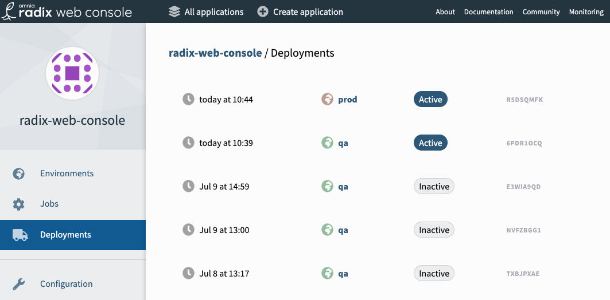

# Overview

[Deployments](../../docs/topic-concepts/#deployment) in Radix are portable, which makes it possible to use them in several scenarios.

Usually deployments are created by a `build-deploy` [job](../../docs/topic-concepts/#job) and deployed into an [environment](../../docs/topic-concepts/#environment). Older deployments remain accessible under the "Deployments" section of the Web Console.

A deployment can be *promoted* into any environment. In effect this creates a new, duplicate deployment, which becomes the *active deployment* in the target environment. The new deployment uses the same component images (Docker images) as the original deployment. The original deployment remains unchanged.

> Careful: Deployments do not encapsulate [environment variables](../../docs/topic-concepts/#environment-variable). When a deployment is promoted from one environment to another, environment variables are read from the **current** settings in `radixconfig.yaml` for the target environment.
>
> The same is true for an old deployment promoted to the same environment: the values of environment variables are those defined in `radixconfig.yaml` at the moment of promotion, not what they were when the original deployment was created.

To promote a deployment you must create a new Job of type `promote`. There are some ways to do this in the Web Console:

- In an environment page, a "promote" button is next to the active deployment
- In the page for a deployment (Deployments → Deployment) there is a "promote" button
- The jobs page has a "new job" button, where "promote" can be selected

# Promote to another environment

Taking the current active deployment from one environment into another is an effective workflow; it can be used as a manual "deploy-to-production" step if you prefer to not map the production environment to a git branch for deployment. The [workflows](../workflows/) guide has an example of how to use this.

# Promote an old deployment/rollback

You can promote an old deployment to become the active deployment within the same environment.

For instance, in case the current active deployment exhibits unwanted behaviour, you can quickly promote a previous deployment to the same environment without rebuilding. Since a new (copied) deployment is created by promotion, the faulty deployment will remain available for promotion (e.g. into another environment for debugging).

The previous deployments of an environment are listed in the respective Web Console's environment page.

Note that if you have a git branch mapped to build and deploy to this environment, Radix will continue to react to new commits and will override the promoted deployment with a new one.
