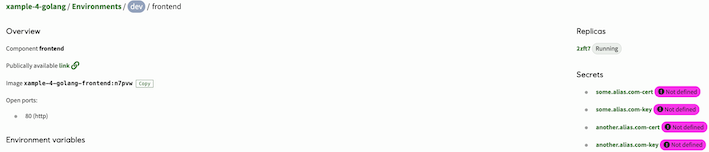
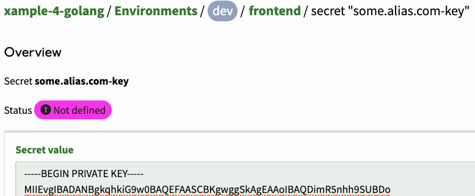

It is possible to make an application available on a custom alias via a setting in `radixconfig.yaml`, provided you register the alias and bring the corresponding TLS certificate into Radix.

This alias must point to the [public name](../../docs/topic-domain-names/#public-name) of a component in your app. By using the public name Radix can ensure that your app will always be available at the same url even when it is internally moved around due to container orchestration. In contrast the canonical name will change according to the same orchestration.

The process for setting up the alias depends on the service used to register and manage the alias. This guide assumes registration of a `*.equinor.com` alias, but you should be able to adapt the instructions to a third-party provider.

## Acquire an Equinor alias

1. Open the [Services@Equinor](https://equinor.service-now.com) portal and find the service "IT infrastructure operational tasks"
2. Request an alias, and specify which [public name](../../docs/topic-domain-names/#public-name) the alias should point to.  
    _Example:_

    ```
    New alias: myapp.equinor.com
    Point to: frontend-myapp-prod.radix.equinor.com
    ```
3. Specify in the request if you need only "internal entry" (used within internal Equinor network) or "both - internal and external entries" (used both - within internal Equinor and public networks).

## Acquire an Equinor certificate

### What you need

You need to request two certificates
- SSL certificate
- Intermediate certificate

Side note: [What is an intermediate certificate?](https://support.ssl.com/Knowledgebase/Article/View/11/0/what-is-an-intermediate-certificate)

These certs can be bundled into one file using the PEM container format, and quite often this file is what we end up calling "the cert we serve the client".  

_Example:_  
A PEM container holding both the SSL and the intermediate certificate in the same file, in this particular order:
```
-----BEGIN CERTIFICATE-----
{ssl certificate content}
-----END CERTIFICATE-----

-----BEGIN CERTIFICATE-----
{intermediate certificate content}
-----END CERTIFICATE-----
```


### How to get it

1. Start by getting to know the appropriate procedure on how to handle keys and certificates in Equinor, as they are considered as sensitive information
1. Create a _Certificate Signing Request_ on you local pc using the `openssl` command:  

    ```sh
    # Step 1: Generate a private key
    openssl genrsa -out ./mydomain.equinor.com.key 2048
    # Keep this file safe and out of version control. You will need it later. 

    # Step 2: Generate Certificate Signing Request (CSR) file using the private key
    openssl req -new -key ./mydomain.equinor.com.key -out ./mydomain.equinor.com.csr
    ```  
1. Open the [Services@Equinor](https://equinor.service-now.com) portal and find the service "Public SSL certificate"
1. Request a SSL certificate and an intermediate certificate for your alias, and attach the CSR file you created in step 2  
1. When you get the requested certificates then store them and the private key in a safe location (see step 1)


## Edit `radixconfig.yaml`

1. You must add a new `dnsExternalAlias` section to the `radixconfig.yaml` file; check the [reference documentation](../../docs/reference-radix-config/#dnsexternalalias) for the details.
1. The application must be built and deployed for the configuration to be applied.
1. If authentication proxy is used - its redirect URL can be changed to use external alias (to avoid showing long proxy URL, when redirected).  

## Apply custom certificate

Adding the certificate information to your application is done using the Radix Console.

Radix needs two pieces of information to enable the certificate for an external alias: 
- the certificate itself, 
- and the private key 

These must be entered as [secrets](../../docs/topic-concepts#secret) in the page of the component chosen as the target of the alias (in the appropriate environment). The two secrets will be named `<domain-name>-cert` and `<domain-name>-key`.



### Add `<domain-name>-cert` secret

Combine the SSL certificate and the intermediate certificate into a single certificate using a PEM container format. Certificates should be put [in particular order](https://www.digicert.com/kb/ssl-support/pem-ssl-creation.htm): first - SSL certificate, second - Intermediate certificate:

```
-----BEGIN CERTIFICATE-----
{ssl certificate content}
-----END CERTIFICATE-----

-----BEGIN CERTIFICATE-----
{intermediate certificate content}
-----END CERTIFICATE-----
```


### Add `<domain-name>-key` secret

Paste the content of the private key file that you generated at the start of the process.



## What's next

Once the secrets are saved, re-deploy the applicable environment(s), either by a new full build-deploy, deploy only or a promotion. The custom aliases will be available.


