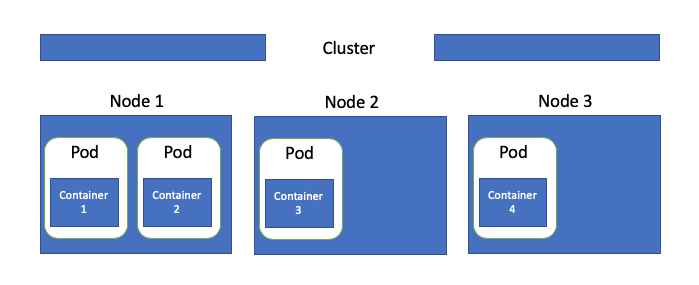
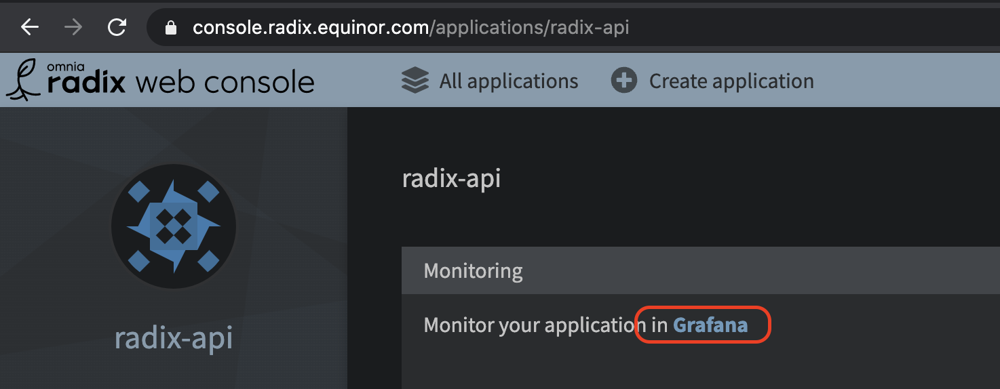
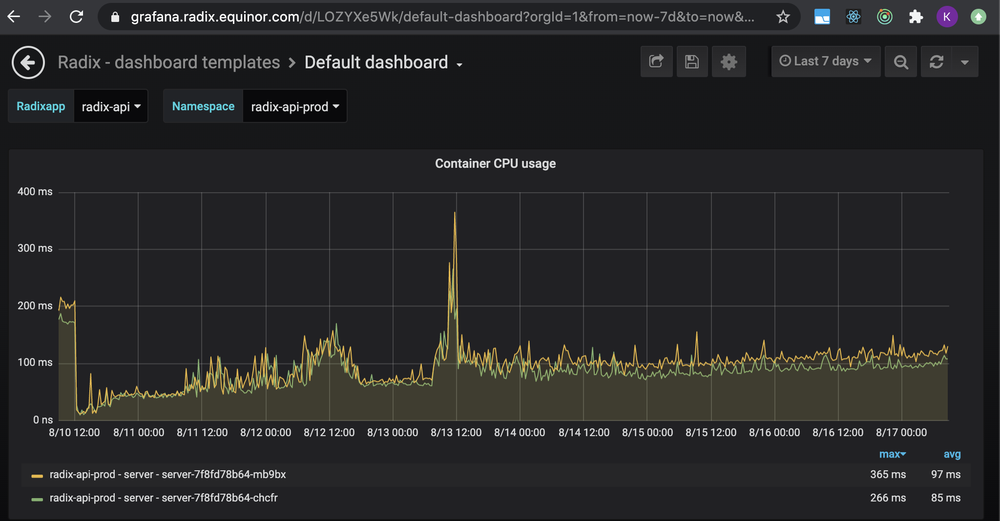
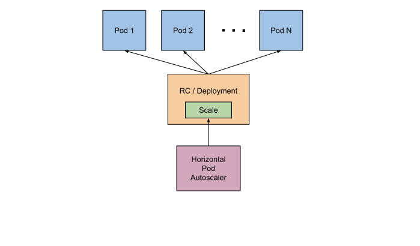

`resources` is used to ensure that each container is allocated enough resources to run as it should. `limits` describes the maximum amount of compute resources allowed. `requests` describes the minimum amount of compute resources requires.

Radix is built on top of managed Kubernetes in Azure (AKS). Kubernetes is a container orchestration platform - orchestrating containers over a set of nodes (VMs). E.g. cluster consisting of 3 nodes, hosting a set of containers:




# Why should resources request and limit be set

Settings resources request and limit is important because of several reasons:

- Kubernetes scheduler guarantees that each container is allocated `resources.requests.cpu` and `resources.requests.memory`. 
- If a node starts hitting CPU limits, it will prioritize and distribute CPU to containers based on `resource.requests.cpu`
- Radix uses `resources.requests` to distribute infrastructure cost between teams. 
- Radix uses `resources.requests` to decide the size of a cluster. 
- Horizontal pod autoscaling uses `resources.requests.cpu` as a target for when to scale up the number of containers.
- `resources.limits.memory` will ensure that the container is stopped if there is any memory leakage

If `resources.requests` and `resources.limits` are not provided, Radix will give a container default [values](https://github.com/equinor/radix-operator/blob/master/charts/radix-operator/values.yaml#L24). This will be used for scheduling and cost. In many cases the default provided `resources` would be insufficient for container, which could lead to the container being CPU throttled or in worst case killed by the [OOMKiller](https://docs.memset.com/other/linux-s-oom-process-killer).

# How to find resource requests and limits

Monitoring can be used to find how much resources an application use. Radix uses [prometheus](https://prometheus.io/) to gather metrics and [grafana](https://grafana.com/) for visualization. When viewing an application in Radix web console, there is a link to a default dashboard in Radix grafana instance that gives a good starting point for monitoring an app.



The default dashboard contains a number of graphs, monitoring different part of an application. For setting `resources` "Container CPU usage" and "Container memory usage" can be used.

CPU and memory are typically impacted by load on an application. If the application is in production, there will already be data that can be used for deciding `resources`. If not, next step involves either running an automated or manual simulation of production environment. It does not need to be very advanced, but it should be possible to see how it behaves under different load. 

Monitoring memory and CPU over time is important, as it can change based on a numerous factors (e.g. new runtime environment, changes to code, increased load, etc). The `resources.requests` adjust set can therefore change during its lifecycle.

Select a single environment and time interval, that represent normal usage for that application. Further examples are based on `radix-api`, where production environment and a period of 7 working days has been selected.

## CPU

CPU is a compressible resource, meaning that if a container hits CPU limit, Kubernetes starts throttling the container. For most application throttling means it will be slower, but it will still be able to serve requests. 

If an underlying node hits CPU limit, it will start throttling CPU resources for containers running on that node. Distribution/priority of CPU for containers running on the node will be based on `resources.requests.cpu` (how much CPU each container will be given). `resources.requests.cpu` is still guaranteed for each container, its only the CPU utilization above `resources.requests.cpu` thats throttled

By clicking a graph, "Container CPU usage", a more detailed view appears. 



The graph shows how many containers are running in production and how the CPU usage has been the last 7 days for each container. Tests are run continuously towards `radix-api`, so there will always be a base CPU usage. This does not need to be the case with other API. 

For `radix-api` normal load gives between 100-200ms of CPU time, peaking at around 400ms. Given us the following setup:

``` yaml
resources:
    requests:
        cpu: "200m"
    limits:
        cpu: "500m"
```

This will allocate `200ms` CPU to each container.  

Because of a limit ([1](https://www.youtube.com/watch?v=eBChCFD9hfs), [2](https://engineering.indeedblog.com/blog/2019/12/unthrottled-fixing-cpu-limits-in-the-cloud/)) in kubernetes and cgroups on how throttling is done, it is recommended to keep `resources.requests.limits` empty or set it to a multitude of `1000ms`. Setup for `radix-api` could then be:

``` yaml
resources:
    requests:
        cpu: "200m"
    limits:
        cpu: "2000m"
```

## Memory

Go back to the `Default dashboard` and select graph `Container memory usage`. 


Memory is a non-compressible resource. Meaning that if a container requires more memory to run than is available, it will be killed. Therefore to guarantee that a container gets enough memory, `resources.requests.memory` is set to the same as `resources.limits.memory`.

The value should be set to above max memory in period of different load (not opening up for memory leakage) For `radix-api` max memory is around 300MB+, setup will therefore be set to:
```
resources.requests.memory: 400MB
resources.limits.memory: 400MB
```
Ensuring that `400MB` is always allocated to each container of `radix-api`.

More information can be found on google - e.g. ["Kubernetes best practices: Resource requests and limits"](https://cloud.google.com/blog/products/gcp/kubernetes-best-practices-resource-requests-and-limits)

# Autoscaling

For modern application development in Kubernetes and in Radix it is preferred to create applications that [scales horizontally rather than vertically](https://www.missioncloud.com/blog/horizontal-vs-vertical-scaling-which-is-right-for-your-app). In horizontal scaling, when there is need for more compute an extra container (pod) is added, but memory and CPU stays fixed. 



For Radix this can easily be done through horizontal pod autoscaling in the [radixconfig.yaml](https://www.radix.equinor.com/docs/reference-radix-config/#horizontalscaling). It will scale up based on CPU load over time for containers of a component (higher than 80%). More information can be found at [kubernetes docs](https://kubernetes.io/docs/tasks/run-application/horizontal-pod-autoscale/)
