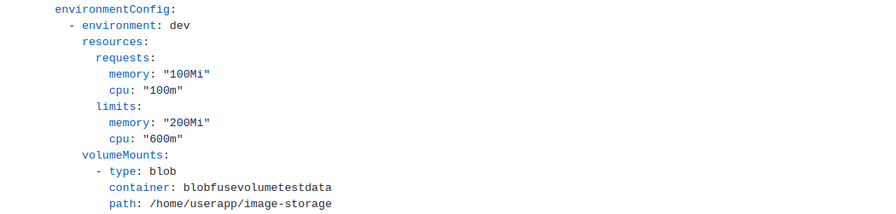
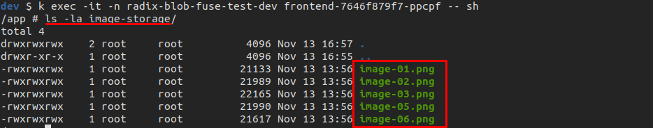

Currently, we support only one type of volume mount. The supported type is to mount Azure Blob Container using blobfuse FlexVolume driver for Kubernetes. See [this](https://github.com/Azure/kubernetes-volume-drivers/tree/master/flexvolume/blobfuse) for more information.

In order to make use of this functionality you have to:

- Retrieve necessary values from Azure Blob Storage

Account name and key


Name of container


- Define the volume mount for the environment in the RadixConfig. Account name and container should match the one found in step 1



- After environment has been built, set the generated secret to key found in step 1. This should ensure that key value is Consistent status. It is recommended to restart a component after a key has been set in the console


This results in the Kubernetes deployment holding the volume mount in its spec:

```yaml
      volumeMounts:
      - mountPath: /home/userapp/image-storage
        name: blobfuse-web
    dnsPolicy: ClusterFirst
    restartPolicy: Always
    schedulerName: default-scheduler
    securityContext: {}
    terminationGracePeriodSeconds: 30
    volumes:
    - flexVolume:
        driver: azure/blobfuse
        options:
          container: blobfusevolumetestdata
          mountoptions: --file-cache-timeout-in-seconds=120
          tmppath: /tmp/radix-blob-fuse-test-dev/web/dev
        secretRef:
          name: web-blobfusecreds
      name: blobfuse-web
```

and the files appear inside the container


