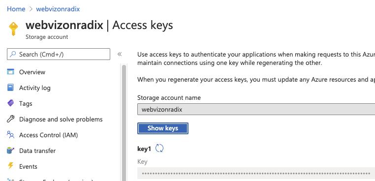
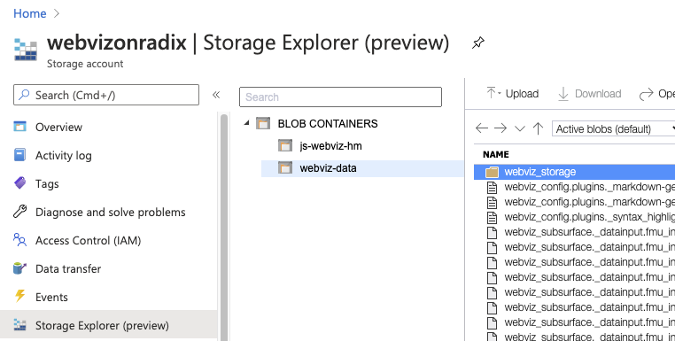
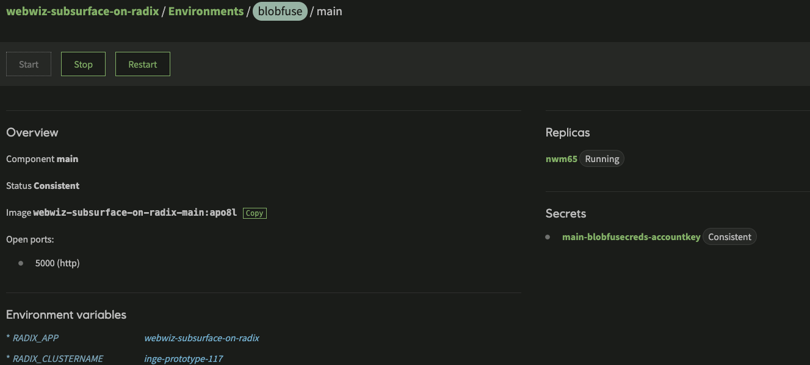
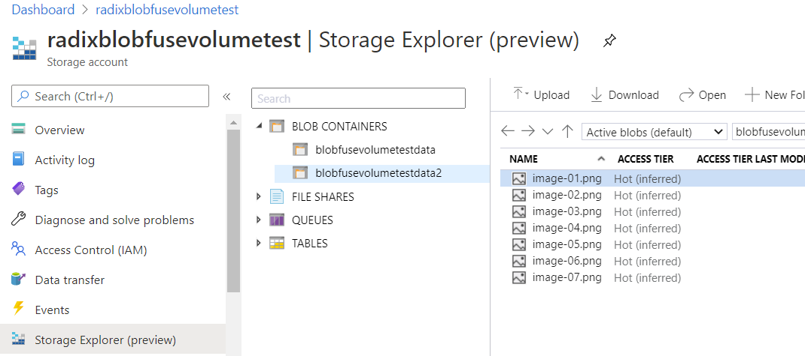
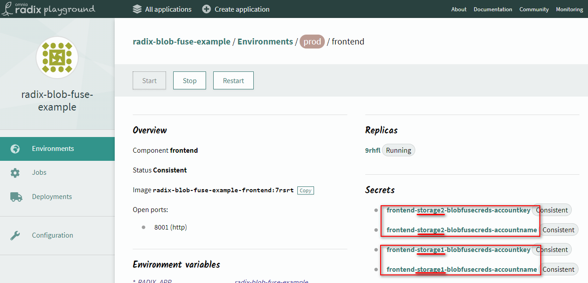

Currently, we support only one type of volume mount. The supported type is to mount Azure Blob Container using blobfuse FlexVolume driver for Kubernetes. See [this](https://github.com/Azure/kubernetes-volume-drivers/tree/master/flexvolume/blobfuse) for more information.

In order to make use of this functionality you have to:

- Retrieve necessary values from Azure Blob Storage

Account name and key


Name of container


- Define the volume mounts for the environment in the RadixConfig. The container should match the one found in step 1

```yaml
      environmentConfig:
        - environment: prod
          volumeMounts:
            - type: blob
              name: storage
              container: blobfusevolumetestdata
              path: /app/image-storage
```

- After environment has been built, set the generated secret to key found in step 1. This should ensure that key value is Consistent status. It is recommended to restart a component after a key has been set in the console



This results in the Kubernetes deployment holding the volume mount in its spec:

```yaml
      spec:
        containers:
          - env:
        ...
      volumeMounts:
        - mountPath: /app/image-storage
          name: blobfuse-frontend-storage
        ...
      volumes:
        - flexVolume:
            driver: azure/blobfuse
            options:
              container: blobfusevolumetestdata
              mountoptions: --file-cache-timeout-in-seconds=120
              name: storage2
              tmppath: /tmp/radix-blob-fuse-example-prod/frontend/prod/blob/storage/blobfusevolumetestdata
            secretRef:
              name: frontend-storage-blobfusecreds
          name: blobfuse-frontend-storage
```
and files appear inside the container. If there are folders within blob container - it will exist in the pod's container as well
```shell
kubectl exec -it -n radix-blob-fuse-example-prod deploy/frontend -- ls -l /app/image-storage
total 0
-rwxrwxrwx    1 root     root         21133 Nov 13 13:56 image-01.png
-rwxrwxrwx    1 root     root         21989 Nov 13 13:56 image-02.png
-rwxrwxrwx    1 root     root         47540 Nov 26 14:51 image-04.png
-rwxrwxrwx    1 root     root         48391 Nov 26 14:50 image-06.png
-rwxrwxrwx    1 root     root         47732 Nov 26 14:50 image-07.png
```
Multiple volume mounts are also supported
* for multiple blob-containers within one storage account
* for containers within multiple storage accounts
* for containers within storage accounts within multiple subscriptions and tenants

Multiple containers within one storage account
  

To add multiple volumes
- Define the volume mounts for the environment in the RadixConfig.
    * add more `volumeMounts`, with `name`-s, unique within `volumeMounts` of an environment (do not use storage account name as this `name` as it is not secure and can be not unique)
    * specify `container` names for each `volumeMount`. The `container` should match the one found in step 1 
    * specify `path` for each `volumeMount`, unique within `volumeMounts` of an environment
    ```yaml
          environmentConfig:
            - environment: prod
              volumeMounts:
                - type: blob
                  name: storage1
                  container: blobfusevolumetestdata
                  path: /app/image-storage
                - type: blob
                  name: storage2
                  container: blobfusevolumetestdata2
                  path: /app/image-storage2
    ```
- After environment has been built, set the generated secret to account name and key, found in step 1 - for each volume. This should ensure that key value is Consistent status. It is recommended to restart a component after a all secrets have been set in the console



This results in the Kubernetes deployment holding the volume mounts in its spec:

```yaml
      spec:
        containers:
          - env:
        ...
      volumeMounts:
        - mountPath: /app/image-storage
          name: blobfuse-frontend-storage
        ...
        volumes:
          - flexVolume:
              driver: azure/blobfuse
              options:
                container: blobfusevolumetestdata
                mountoptions: --file-cache-timeout-in-seconds=120
                name: storage1
                tmppath: /tmp/radix-blob-fuse-example-prod/frontend/prod/blob/storage1/blobfusevolumetestdata
              secretRef:
                name: frontend-storage1-blobfusecreds
            name: blobfuse-frontend-storage1
          - flexVolume:
              driver: azure/blobfuse
              options:
                container: blobfusevolumetestdata2
                mountoptions: --file-cache-timeout-in-seconds=120
                name: storage2
                tmppath: /tmp/radix-blob-fuse-example-prod/frontend/prod/blob/storage2/blobfusevolumetestdata2
              secretRef:
                name: frontend-storage2-blobfusecreds
            name: blobfuse-frontend-storage2
```
and files appear inside the container

```shell
kubectl exec -it -n radix-blob-fuse-example-prod deploy/frontend -- ls -lR /app
/app:
total 4
drwxrwxrwx    2 root     root          4096 Dec 11 15:10 image-storage
drwxrwxrwx    2 root     root          4096 Dec 11 15:10 image-storage2
-rw-r--r--    1 root     root          1343 Dec 11 11:52 index.html

/app/image-storage:
total 0
-rwxrwxrwx    1 root     root         21133 Nov 13 13:56 image-01.png
-rwxrwxrwx    1 root     root         21989 Nov 13 13:56 image-02.png
-rwxrwxrwx    1 root     root         47540 Nov 26 14:51 image-04.png
-rwxrwxrwx    1 root     root         48391 Nov 26 14:50 image-06.png
-rwxrwxrwx    1 root     root         47732 Nov 26 14:50 image-07.png

/app/image-storage2:
total 0
-rwxrwxrwx    1 root     root         27803 Dec 11 11:11 image-01.png
-rwxrwxrwx    1 root     root         28692 Dec 11 11:11 image-02.png
-rwxrwxrwx    1 root     root         29008 Dec 11 11:11 image-03.png
-rwxrwxrwx    1 root     root         59023 Dec 11 11:11 image-04.png
-rwxrwxrwx    1 root     root         28732 Dec 11 11:11 image-05.png
-rwxrwxrwx    1 root     root         60062 Dec 11 11:11 image-06.png
-rwxrwxrwx    1 root     root         59143 Dec 11 11:11 image-07.png
```