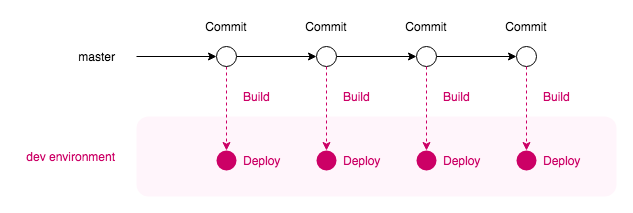
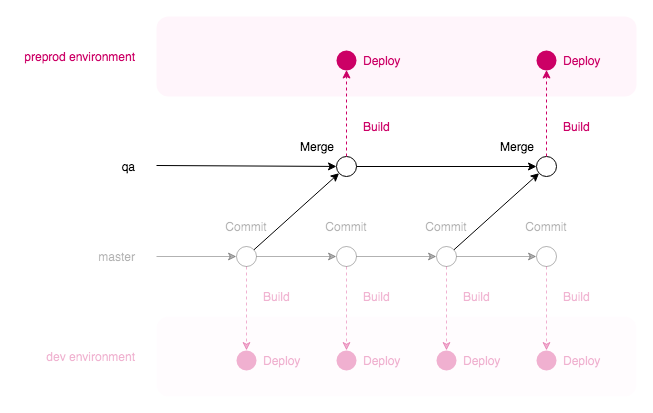

# Overview

In Radix, our development workflow can be modelled to match our needs. It is possible to use, for instance [Git Flow](https://nvie.com/posts/a-successful-git-branching-model/) or [Trunk-based development](https://paulhammant.com/2013/04/05/what-is-trunk-based-development/). Radix gives us a couple of tools to shape our workflow: **branch-environment mapping** and **deployment promotion**.

If we **map** a git branch to an environment, commits to that branch will trigger a build and deployment to the specified environment. For instance, a `dev` environment might be built and deployed from `master`, while a `prod` environment can be built and deployed from the `production` branch. Branches and environments that are not mapped are ignored and do not trigger automatic builds or deployments.

**Promotion** allows us to take an existing deployment in an environment, and deploy it in another. For instance, take what is currently running in the `preprod` environment and place it in `prod`.

It is fine to combine these features to produce the workflow that we want. For instance, we can automatically build and deploy `master` to the `dev` environment, and the `release` branch to `preprod`. We can then manually promote the deployment in `preprod` to the `prod` environment.

# An example with branches mapped to different environments

Let's go over the example above in more detail. We are continuously working on `master`, and we want commits here to be automatically deployed to `dev`:



In `radixconfig.yaml` we define this behaviour like so:

```yaml
spec:
  environments:
    - name: dev
      build:
        from: master
```

Let's create a `qa` branch, which builds and deploys to a `preprod` environment. When `master` is in a "ready-to-test" state, we will merge `master` to `qa`.



Here's how `radixconfig.yaml` looks now:

```yaml
spec:
  environments:
    - name: dev
      build:
        from: master
    - name: preprod
      build:
        from: qa
```

# An example of promotion

Finally, building on the previous example, if `preprod` is working fine, we can then manually **promote** the deployment to the `prod` environment:


This is our final workflow configuration in `radixconfig.yaml` (note that `prod` is not mapped — we will promote deployments manually via the Radix Web Console):

```yaml
spec:
  environments:
    - name: dev
      build:
        from: master
    - name: preprod
      build:
        from: qa
    - name: prod
```

# An example of multiple branches to one environment

There is also an ability in Radix to map many branches to one environment. I.e. you could map feature/* branches to one feature environment. This is particularly useful for developers needing to pre-test their features in an environment as close to production as possible. Team needs to take care on who can use this environment at one point in time. Example of this mapping:

```yaml
spec:
  environments:
    - name: feature
      build:
        from: feature/*
    - name: release
      build:
        from: release/*
    - name: hotfix
      build:
        from: hotfix/**/*
    - name: preprod
      build:
        from: master
    - name: prod
```