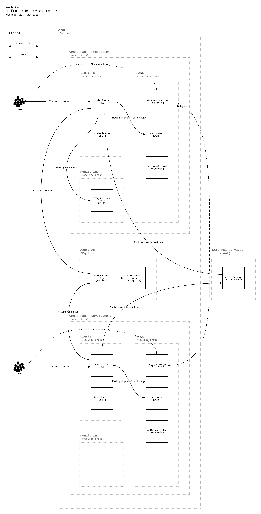

## Summary

The radix-platform is in essence a k8s cluster with a thin control layer (radix components) installed for how we want the cluster to be used.  
This is realized as an Azure Kubernetes Service (AKS) using Azure AD for authentication and authorization, along with misc support infrastructure.  

We want to be able to 

    - control traffic in/out of the cluster
    - control access to the cluster and the usage of its resources
    - rebuild the cluster at will
    - create multiple clusters for different use cases
    - monitor the cluster and it's siblings
    - provision all the above

This is how we do that:

- [Azure resources](./azure-resources.md)
- [Access control](./access-control.md)
- [DNS](./dns.md)

