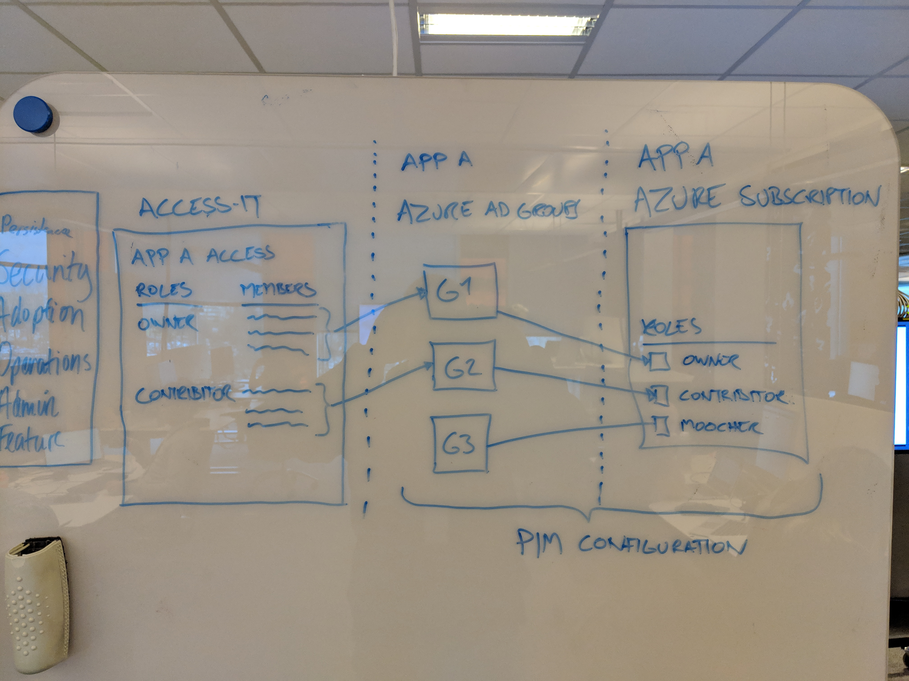

IAM want to use PIM for all azure subcriptions and related roles, and the intial scaffolding from their side is up and running.

The configuration per app looks like this
1. Azure roles are related to azure ad groups (configured in PIM)
1. Group membership is managed in AccessIT
1. Group member ask PIM to be granted the role on a time based limit in the azure portal

