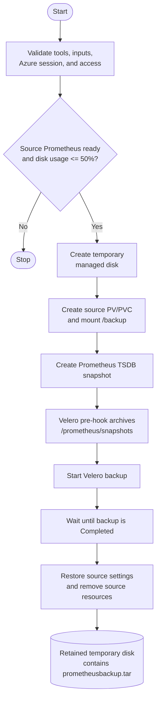
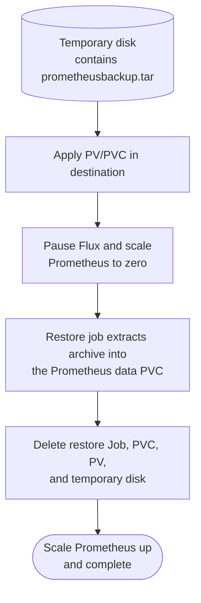
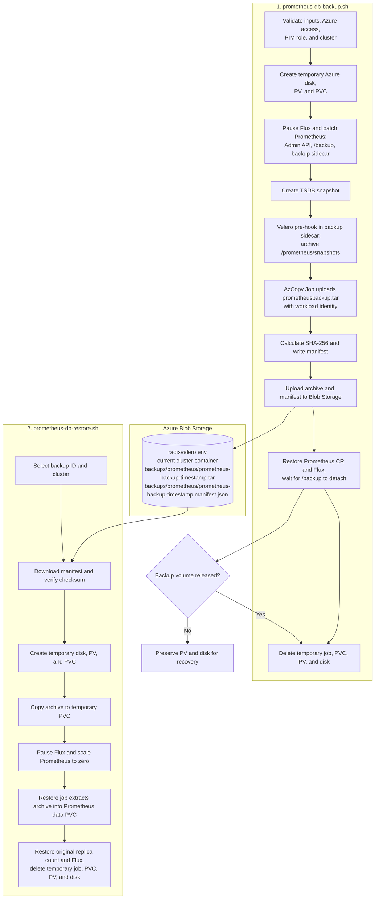

# Prometheus Operator

## Prometheus database backup and restore

`prometheus-db-backup.sh` stores a Prometheus TSDB snapshot in Azure Blob
Storage. `prometheus-db-restore.sh` restores a selected snapshot later into a
new or replacement cluster. Each script uses a temporary Azure managed disk
only while transferring the archive.

Create a backup:

```sh
RADIX_ZONE=dev CLUSTER=weekly-33 ./prometheus-db-backup.sh
```

Restore a named backup:

```sh
RADIX_ZONE=dev BACKUP_CLUSTER=weekly-33 CLUSTER=weekly-34 \
BACKUP_NAME=prometheus-backup-20260820143000 ./prometheus-db-restore.sh
```

The cluster must already have `kube-prometheus-stack` installed and
the Prometheus data PVC name expected by
`prometheus-restore-job.yaml`.

### Prometheus Migration

This describes the previous single-run backup and restore flow. It remains as a
reference for the temporary-disk staging mechanism, but is no longer performed
by `prometheus-db-backup.sh`.

#### Prometheus Backup Flow



#### Prometheus Restore Flow



The archive is created by the pre-hook after the Prometheus snapshot job has
completed. The destination restore job reads the archive from the same Azure
disk and extracts it into the destination Prometheus data PVC. The final PVC
and PV deletion removes the retained temporary disk through the PV reclaim
policy.

### Durable backup and delayed restore

To migrate at a later time, split the current script into a backup script and
a restore script. Store the archive in the cluster's existing Velero container,
under `backups/prometheus/`. The zone's Velero storage account is available to
scripts as `velero_sa` through `environment_json` and is named
`radixvelero{environment}`.

For example, a backup from `weekly-33` in the development environment is
stored at:

```text
radixvelerodev / weekly-33 / backups / prometheus / prometheus-backup-20260820143000.tar
```

The layout of the `weekly-33` container is then:

```text
backups/                Velero-managed backup data
    prometheus/           Prometheus TSDB archives managed by these scripts
        prometheus-backup-<timestamp>.tar
        prometheus-backup-<timestamp>.manifest.json
restores/               Velero-managed restore data
```



Both scripts use strict error handling and cleanup traps. On a failed backup,
the source Prometheus configuration and Flux release are restored before the
staging storage is removed. If the source Pod does not release the temporary
`/backup` volume, the script preserves the PV and disk instead of forcing a
detach that could leave a stale CSI attachment.

The scripts should use an immutable backup ID, for example
`prometheus-backup-YYYYMMDDHHMMSS`, as the Blob filename prefix. The restore
script must require that ID and cluster rather than selecting the newest backup
automatically.

#### Why Blob Storage

| Benefit | Temporary managed disk | Blob Storage |
| --- | --- | --- |
| Restore later | Deleted by the current migration flow | Retained until lifecycle policy removes it |
| Restore to a new cluster | Requires the source disk to remain available | Any authorized cluster can download the selected backup |
| Cost for inactive backups | Charges as provisioned disk capacity | Charges for stored bytes and selected access tier |
| Backup catalogue | No durable metadata | Cluster container, Blob prefix, and manifests identify each backup |
| Integrity verification | No persistent record | Store a SHA-256 checksum in the manifest |
| Retention | Manual disk management | Lifecycle policies can expire or tier old backups |

Use Azure AD data-plane authorization (`--auth-mode login` from the operator,
or a workload identity for uploader/downloader jobs) rather than storage account
keys. The existing Velero `BackupStorageLocation` already targets this storage
account and source-cluster container through the configured private network
path. The new uploader and downloader still need explicit Blob data-plane
authorization; a `BackupStorageLocation` does not itself grant another job
permission to upload or download blobs.

<!-- topk(5,radix_operator_request_sum) -->