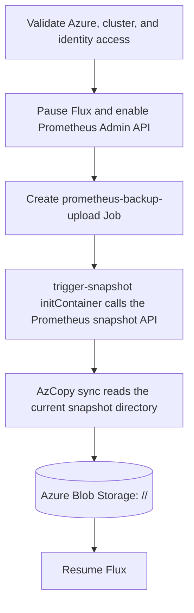
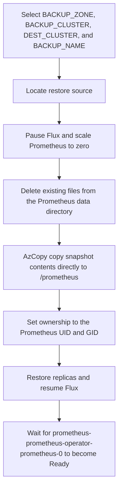

# Prometheus Operator

## Prometheus database backup and restore

The backup and restore scripts store Prometheus TSDB snapshot files directly in
Azure Blob Storage. Velero and temporary staging disks are not used.

### Backup

Run a new backup with an automatic timestamp:

```sh
RADIX_ZONE=dev CLUSTER="weekly-34" ./prometheus-db-backup.sh
```

Continue an existing backup incrementally by reusing its `BACKUP_NAME`:

```sh
RADIX_ZONE=dev CLUSTER="weekly-34" \
BACKUP_NAME="prometheus-backup-20260825110832" \
./prometheus-db-backup.sh
```

Each run creates a full Prometheus snapshot, but `azcopy sync` transfers only
new or changed files to the existing Blob folder. The backup is stored in the
cluster's zone storage account:

```text
<cluster>/<backup-name>/
        <Prometheus snapshot files>
```

The Prometheus snapshot API still creates a timestamped snapshot directory on
the PVC, but the backup Job syncs the contents of that directory into the Blob
backup root. Reusing the same `BACKUP_NAME` therefore lets `azcopy sync` compare
the same Blob paths across runs. Files that no longer exist in the latest
snapshot are deleted from that backup root so a restore mirrors the newest
snapshot state.

The backup Job runs these steps in order:



Monitor a running backup:

```sh
kubectl --context "${CLUSTER}" logs -n monitor \
    -l job-name=prometheus-backup-upload --all-containers --prefix -f
kubectl --context "${CLUSTER}" get pods -n monitor \
    -l job-name=prometheus-backup-upload -w
```

### Restore

Restore within one zone:

```sh
RADIX_ZONE=dev \
BACKUP_CLUSTER="weekly-33" \
DEST_CLUSTER="weekly-34" \
BACKUP_NAME="prometheus-backup-20260820143000" \
./prometheus-db-restore.sh
```

Restore from Playground to Dev:

```sh
RADIX_ZONE=dev \
BACKUP_ZONE=playground \
BACKUP_CLUSTER="playground-29" \
DEST_CLUSTER="weekly-34" \
BACKUP_NAME="prometheus-backup-20260825110832" \
./prometheus-db-restore.sh
```

For a cross-zone restore, the destination identity must be able to read the
source storage account. In the example above:

```text
Destination identity: radix-id-prometheus-backup-dev
Source account:       radixveleroplayground
Required role:        Storage Blob Data Reader
```

The Dev destination VNet must also reach the Playground Blob endpoint through
a Private Endpoint and resolve it through `privatelink.blob.core.windows.net`.
The restore ServiceAccount is:

```text
monitor/prometheus-backup-uploader
```

The restore process is:



    Before a cross-zone restore, the script displays the Private Endpoint, Private
    DNS, connection verification, and RBAC create commands. After the restore is
    complete and Prometheus is Ready, it displays optional commands to remove the
    Private DNS zone group, Private Endpoint, and temporary Blob Reader role. The
    cleanup commands are never executed by the script.

The destination data PVC is mounted by Prometheus as:

```text
PVC:     prometheus-prometheus-operator-prometheus-db-prometheus-prometheus-operator-prometheus-0
Mount:   /prometheus
SubPath: prometheus-db
```

The restore deletes the existing contents of that `prometheus-db` subpath,
copies the snapshot files directly into `/prometheus`, corrects ownership, and
does not create an `old` directory or a temporary disk. The backup and restore
Jobs remain in the cluster after completion so their logs can be inspected.
Before a new run, the existing Job with the same name is deleted and recreated.
Backups created with the older timestamp-folder layout are still supported; the
restore script selects the newest timestamped snapshot folder when needed.

Monitor a running restore:

```sh
kubectl --context "${DEST_CLUSTER}" logs -n monitor \
    -l job-name=prometheus-restore --all-containers --prefix -f
kubectl --context "${DEST_CLUSTER}" get pods -n monitor \
    -l job-name=prometheus-restore -w
kubectl --context "${DEST_CLUSTER}" exec -n monitor \
    -l job-name=prometheus-restore -c azcopy -- du -sh /prometheus
```

Both scripts use Azure Workload Identity for in-cluster AzCopy. The workload
identity ServiceAccount requires a federated credential with the destination
cluster OIDC issuer, subject
`system:serviceaccount:monitor:prometheus-backup-uploader`, and audience
`api://AzureADTokenExchange`.

<!-- topk(5,radix_operator_request_sum) -->