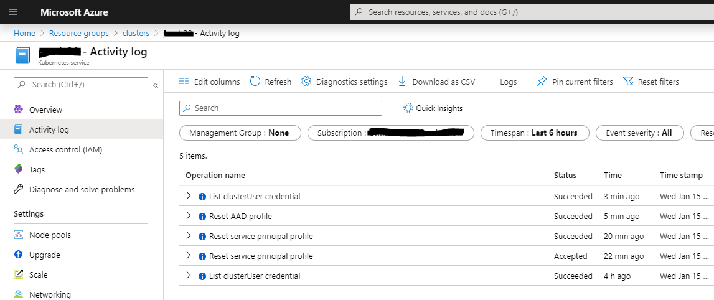

# Radix scripts for service principals and aad apps

This directory contains scripts for handling common use cases when dealing with service principals and aad apps.  
A library for the most used functions can be found in the [`lib_service_principal.sh`](lib_service_principal.sh) file.

## Table of contents

- [Components](#Components)
- [Best practice](#best-practice)
- [Prerequisites](#Prerequisites)
- [Use cases](#use-cases)
   - [Bootstrap and teardown cluster service principals](#bootstrap-and-teardown-cluster-service-principals)
   - [Refresh credentials](#refresh-credentials)
      - [Refresh component service principals credentials](#refresh-component-service-principals-credentials)
      - [Refresh component AAD app credentials](#refresh-component-aad-app-credentials)
      - [Refresh AKS credentials](#refresh-aks-credentials)
   - [Delete a service principal and related stored credentials](#delete-a-service-principal-and-related-stored-credentials)
   - [Troubleshooting](#troubleshooting)

## Components

- Azure AD
- Azure AD service principal
- Azure AD app
- Azure key vault

## Best practice

_Store credentials in a reusable format_  
All credentials should be stored in radix key vault as json using the schema provided by the [`template-credentials.json`](./template-credentials.json) file.  

_Component bootstrap and teardown should include handling component credentials_  
Components that require service principals and/or aad apps should handle this is part of their own bootstrap/teardown process.  

## Prerequisites

User must have the Azure AD role "Application Developer" active in order to work with Azure AD.  
The library [`lib_service_principal.sh`](lib_service_principal.sh) has a function that can perform this check in your scripts: `exit_if_user_does_not_have_required_ad_role()`

## Use cases

### Bootstrap and teardown cluster service principals

- [`bootstrap.sh`](./bootstrap.sh)
- [`teardown.sh`](./teardown.sh)

Bootstrap and teardown are scoped to handle the bare minimum service principals to get a radix cluster up and running,  
- Cluster SP
- Container registry SP
- CICD SP
- DNS SP

For any other SP see the bootstrap/teardown scripts for the components that require service principals.

### Refresh credentials

Refreshing credentials for a service principal is usually a four step process for most components:
1. Refresh secret (..."password") in Azure AD
1. Update credentials in key vault in a reusable format (see [`template-credentials.json`](./template-credentials.json))
1. Update the credentials for the component that use this SP in the cluster  
   This process should be an automated process specific to each component,  
   - Read the credentials from key vault, 
   - Reformat them to how ever the component wants them using a template and...
   - Upload them as a k8s secret into the cluster
1. Restart the component pods to force it to read the updated k8s secret(s)

Keep in mind the following:

- _Service principals != Azure AD apps_  
  Service principals and az ad apps are two related, not identical, beasts that must handled slightly differently when refreshing their credentials in Azure AD.  

- _Cluster service principal and Cluster Azure AD app (rbac integration)_  
  Update credentials for a component versus updating credentials for AKS are two separate processess.  

- _Multiple components may use the same service principal_  
  In this case you only need to refresh the service principal credentials _once_ in both Azure AD and the key vault.  
  Then it is simply a case of updating the credentials for each component that depend on that service principle in the cluster using the updated credentials found in the keyvault.

#### Refresh component service principals credentials

1. Decide if you need to refresh the service principal credentials in AAD  
   Multiple components may use the same service principal and refreshing credentials in AAD will impact all of them 
   - If yes to refresh credentials in AAD: 
     Refresh credentials in AAD and store them in keyvault by using script [`refresh_service_principal_credentials.sh`](./refresh_service_principal_credentials.sh)
1. Manually update the credentials in the clusters for the component that use it  
   Usually the easiest way to do this is 
   1. Run install base components script to update k8s secrets
   1. Delete all the running pods of the component so that k8s will redeploy them with updated k8s secret  
      Examples:
      - Delete all `external-dns` pods to refresh DNS credentials
      - Delete all `cert-manager` pods to refresh DNS credentials
      - Delete all `radix-operator` pods to refresh ACR/CICD credentials

#### Refresh component AAD app credentials

1. Decide if you need to refresh the AAD app credentials in AAD  
   Multiple components may use the same AAD app and refreshing credentials in AAD will impact all of them
   - If yes to refresh credentials in AAD: 
     Refresh credentials in AAD and store them in keyvault by using script [`refresh_aad_app_credentials.sh`](./refresh_aad_app_credentials.sh)
1. Manually update the credentials in the clusters for the component that use it  
   Usually the easiest way to do this is 
   1. Run install base components script to update k8s secrets
   1. Delete all the running pods of the component so that k8s will redeploy them with updated k8s secret

#### Refresh Radix Web Console App Credentials

There are currently three app registrations for Radix Web Console:
- Radix Web Console - Development Clusters
- Radix Web Console - Playground Clusters
- Radix Web Console - Production Clusters

Each of them are used by one or multiple clusters and is defined by the OAUTH2_PROXY_CLIENT_ID variable in the zone-files.

1. Decide if you need to refresh the client secret for any of the Radix Web Console app registrations.
   Multiple clusters may use the same Radix Web Console app registration and refreshing the app secret will impact all of them.
   - If yes to refresh the client secret in AAD:
     Refresh client secret for Radix Web Console and store in keyvault by using script ['refresh_web_console_app_credentials.sh](./refresh_web_console_app_credentials.sh)
1. Update the OAUTH2_CLIENT_PROXY_SECRET for Radix Web Console auth component in all clusters using the app registration
   - Manual: Use Radix Web Console, navigate to the radix-web-console application's `auth` component and update the `OAUTH2_PROXY_CLIENT_SECRET` secret with the newly generated app secret.
   - Script: Run [update_auth_proxy_secret_for_console.sh](./../update_auth_proxy_secret_for_console.sh) to update k8s secret for the `auth` component

### Refresh Radix ServiceNow Proxy Client app registration credentials

See [README.md](../servicenow-proxy/README.md)

## Delete a service principal and related stored credentials

Use script [`delete_service_principal_and_stored_credentials.sh.sh`](./delete_service_principal_and_stored_credentials.sh.sh)

## Troubleshooting

### Sticky "update aks credentials" session

At times the command `az aks update-credentials` can be very slow, most often due to azcli not being able to get a proper reply from the azure api.  
If you press `CTRL+C` while the terminal shows `- Running` then it will continue to the next step in the script and by so you can "massage" the process forward.  
The other, harder, option is to cancel the script, comment out the long running step in code and then rerun the script to get to the next steps.  
To verify that the operations have run then take a look in the activity log for the cluster you are working on.  

